<!--
 * @Author: LiuFeng(USTC) : 
   * liufeng2317@mail.ustc.edu.cn
   * liufeng1@pjlab.org.cn
 * @Date: 2023-07-03 11:16:43
 * @LastEditors: LiuFeng
 * @LastEditTime: 2024-01-02 13:16:52
 * @FilePath: /ADFWI/README.md
 * @Description: 
 * Copyright (c) 2024 by liufeng2317 email: liufeng1@pjlab.org.cn, All Rights Reserved.
-->

<div align="center">
  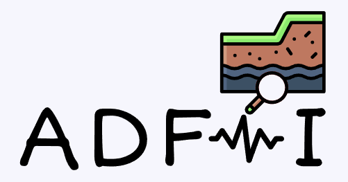
</div>
<br/>
<div align="center">
  
  
  
</div>
<div align="center">
  
  
  
  
  
  
</div>
<h1 align="center">Automatic Differentiation-Based Full Waveform Inversion</h1>

- [👩‍💻 Introduction](#-introduction)
- [⚡️ Installation](#️-installation)
- [👾 Examples](#-examples)
  - [1. Iso-acoustic Model Tests](#1-iso-acoustic-model-tests)
  - [2. Iso-elastic \& VTI-elastic Model Tests](#2-iso-elastic--vti-elastic-model-tests)
  - [3. Misfits Tests](#3-misfits-tests)
  - [4. Optimizer Tests](#4-optimizer-tests)
  - [5. Regularization Methods](#5-regularization-methods)
  - [6. Deep Image Prior (Earth Model Reparameterization)](#6-deep-image-prior-earth-model-reparameterization)
  - [7. Uncertainty Estimation Using Deep Neural Networks (DNNs)](#7-uncertainty-estimation-using-deep-neural-networks-dnns)
- [📝 Features](#-features)
- [⚖️ LICENSE](#️-license)
- [🗓️ To-Do List](#️-to-do-list)
- [🔰 Contact](#-contact)

---

## 👩‍💻 Introduction
**ADFWI** is an open-source framework for high-resolution subsurface parameter estimation by minimizing discrepancies between observed and simulated seismic data. Utilizing automatic differentiation (AD), ADFWI **simplifies the derivation and implementation of Full Waveform Inversion (FWI)**, enhancing the design and evaluation of methodologies. It supports wave propagation in various media, including isotropic acoustic, isotropic elastic, and both vertical transverse isotropy (VTI) and tilted transverse isotropy (TTI) models.

In addition, **ADFWI** provides a comprehensive collection of Objective functions, regularization techniques, optimization algorithms, and deep neural networks. This rich set of tools facilitates researchers in conducting experiments and comparisons, enabling them to explore innovative approaches and refine their methodologies effectively.

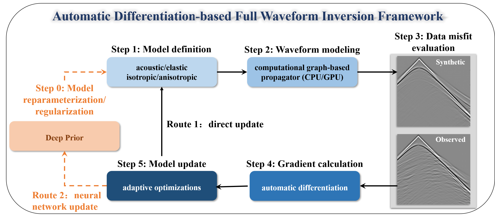

---

## ⚡️ Installation

To install the Automatic Differentiation-Based Full Waveform Inversion (ADFWI) framework, please follow these steps:

1. **Ensure Prerequisites**  
   Before you begin, make sure you have the following software installed on your system:  
   - **Python 3.8 or higher**: Download Python from the official website: [Python Downloads](https://www.python.org/downloads/).
   - **pip** (Python package installer).

2. **Create a Virtual Environment (Optional but Recommended)**
   It is recommended to create a virtual environment to manage your project dependencies. You can use either `venv` or `conda`. 
   For example, using `conda`:
   ```bash
   conda create --name adfwi-env python=3.8
   conda activate adfwi-env
   ```

3. **Install Required Packages**
- Method 1: **Clone the github Repository**
  This method provides the latest version, which may be more suitable for your research:
    ```bash
    git clone https://github.com/liufeng2317/ADFWI.git
    cd ADFWI
    ```
    Then, install the necessary packages:
    ```bash
    pip install -r requirements.txt
    ```
- Method 2: Install via pip
  Alternatively, you can directly install ADFWI from PyPI:
  ```bash
    pip install ADFWI-Torch
  ```

4. **Verify the Installation**
  To ensure that ADFWI is installed correctly, run any examples located in the examples folder.

5. **Troubleshooting**
   If you encounter any issues during installation, please check the Issues section of the GitHub repository for potential solutions or to report a new issue.

---

## 👾 Examples

### 1. Iso-acoustic Model Tests

<table>
    <tr>
        <th style="text-align: center;">Model Test Name</th>
        <th style="text-align: center;">Implemented</th>
        <th style="text-align: center;">Example's Path</th>
        <th style="text-align: center;">Example's Figure</th>
    </tr>
    <tr>
        <td style="text-align: center; vertical-align: middle;">Iso-acoustic Marmousi2</td>
        <td style="text-align: center; vertical-align: middle;">✅</td>
        <td style="text-align: center; vertical-align: middle;"><a href="./examples/acoustic/01-model-test/01-Marmousi2/02_inversion.ipynb">Example-Marmousi2</a></td>
        <td style="text-align: center; vertical-align: middle;"></td>
    </tr>
    <tr>
        <td style="text-align: center; vertical-align: middle;">Iso-acoustic FootHill</td>
        <td style="text-align: center; vertical-align: middle;">✅</td>
        <td style="text-align: center; vertical-align: middle;"><a href="./examples/acoustic/01-model-test/02-FootHill/02_inversion.ipynb">Example-FootHill</a></td>
        <td style="text-align: center; vertical-align: middle;">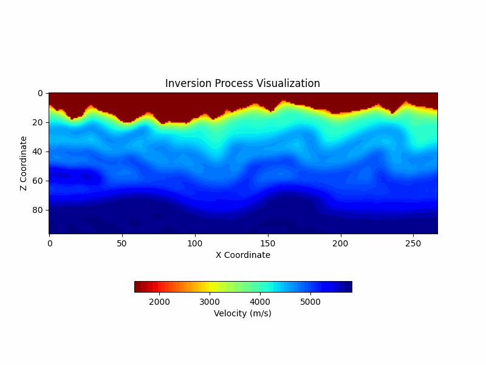</td>
    </tr>
    <tr>
        <td style="text-align: center; vertical-align: middle;">Iso-acoustic SEAM-I</td>
        <td style="text-align: center; vertical-align: middle;">✅</td>
        <td style="text-align: center; vertical-align: middle;"><a href="./examples/acoustic/01-model-test/03-SEAM-I/02_inversion.ipynb">Example-SEAM-I</a></td>
        <td style="text-align: center; vertical-align: middle;">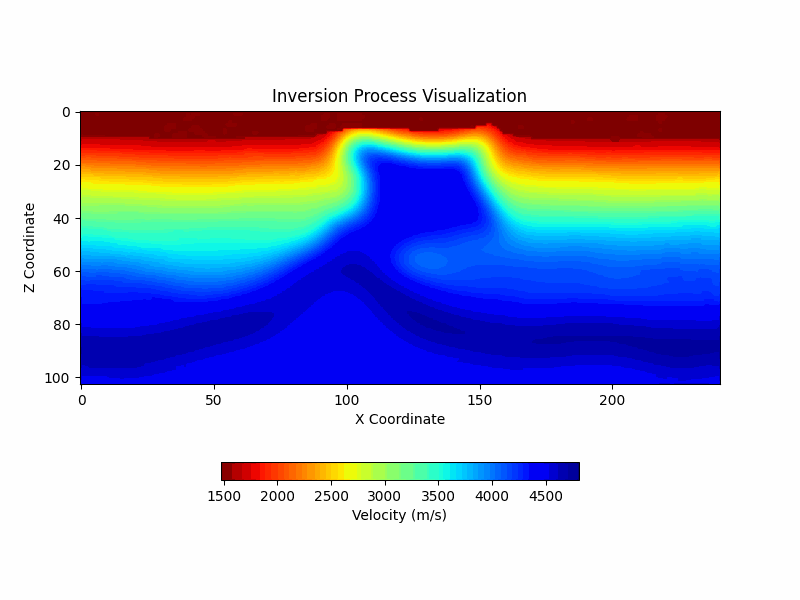</td>
    </tr>
    <tr>
        <td style="text-align: center; vertical-align: middle;">Iso-acoustic Overthrust-offshore</td>
        <td style="text-align: center; vertical-align: middle;">✅</td>
        <td style="text-align: center; vertical-align: middle;"><a href="./examples/acoustic/01-model-test/04-Overthrust-offshore/02_inversion.ipynb">Example-Overthrust-offshore</a></td>
        <td style="text-align: center; vertical-align: middle;">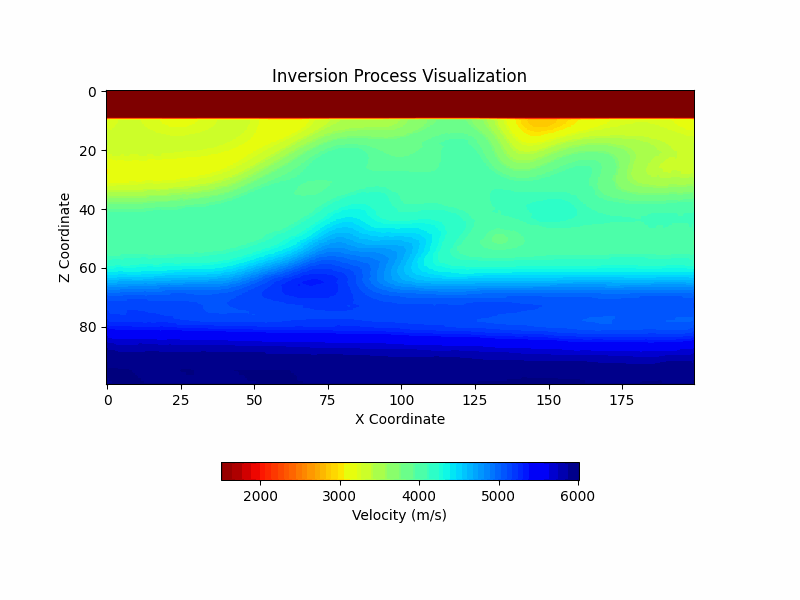</td>
    </tr>
    <tr>
        <td style="text-align: center; vertical-align: middle;">Iso-acoustic Anomaly</td>
        <td style="text-align: center; vertical-align: middle;">✅</td>
        <td style="text-align: center; vertical-align: middle;"><a href="./examples/acoustic/01-model-test/05-Anomaly/02_inversion.ipynb">Example-Anomaly</a></td>
        <td style="text-align: center; vertical-align: middle;">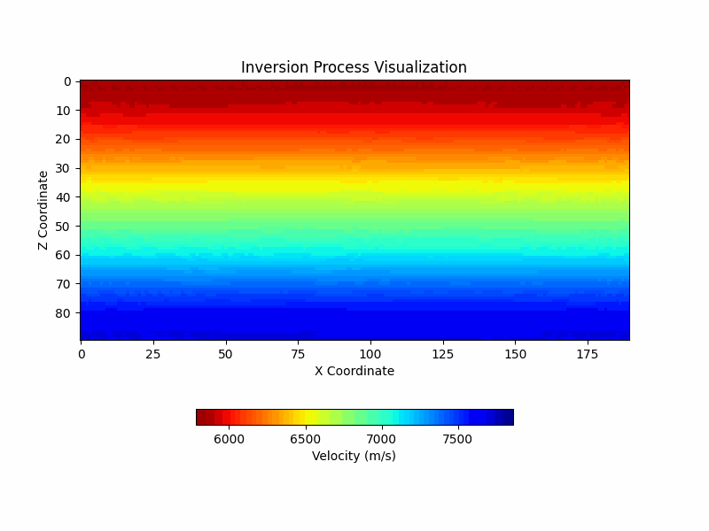</td>
    </tr>
</table>


### 2. Iso-elastic & VTI-elastic Model Tests

<table>
    <tr>
        <th style="text-align: center;">Model Test Name</th>
        <th style="text-align: center;">Implemented</th>
        <th style="text-align: center;">Example Path</th>
        <th style="text-align: center;">Example Figure</th>
    </tr>
    <tr>
        <td style="text-align: center; vertical-align: middle;">Iso-elastic Marmousi2</td>
        <td style="text-align: center; vertical-align: middle;">✅</td>
        <td style="text-align: center; vertical-align: middle;">
            <a href="./examples/elastic/Iso-elastic-Marmousi2/02_inversion.py">Example-Marmousi2</a>
        </td>
        <td style="text-align: center; vertical-align: middle;">
            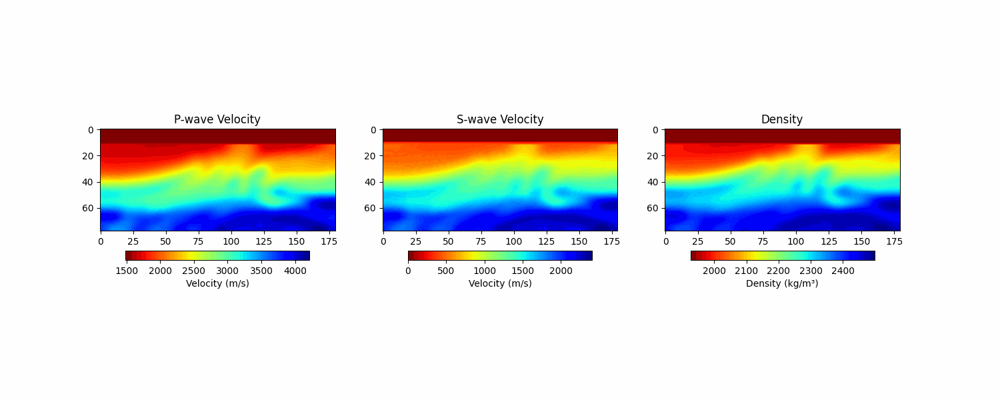
        </td>
    </tr>
    <tr>
        <td style="text-align: center; vertical-align: middle;">VTI-elastic Anomaly</td>
        <td style="text-align: center; vertical-align: middle;">✅</td>
        <td style="text-align: center; vertical-align: middle;">
            <a href="./examples/elastic/VTI-elastic-Anomaly/02_inversion.py">Example-Anomaly</a>
        </td>
        <td style="text-align: center; vertical-align: middle;">
            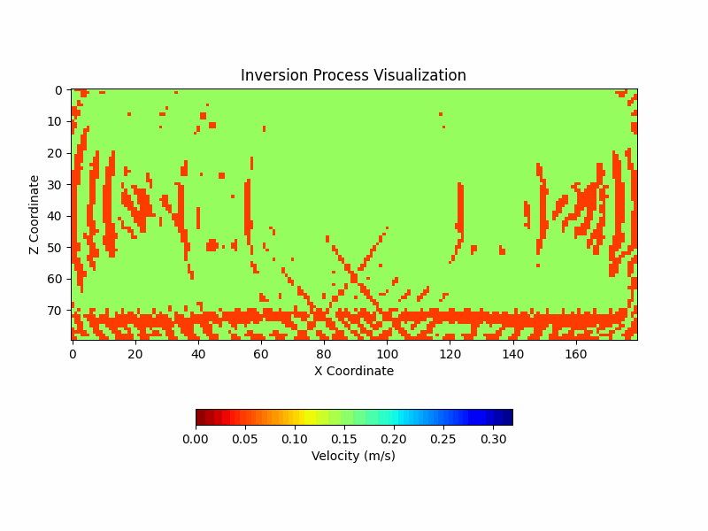
        </td>
    </tr>
</table>

### 3. Misfits Tests

It is worth mentioning that here we show the performance of different objective functions under **poorer initial models**, and under better initial model conditions, each objective function performs better, and the relevant results can be found in [Better Initial Model](./examples/acoustic/02-misfit-functions-test/01-Marmousi2-Test/).

<table>
    <tr>
        <th style="text-align: center;">Model Test Name</th>
        <th style="text-align: center;">Implemented</th>
        <th style="text-align: center;">Example Path</th>
        <th style="text-align: center;">Example Figure</th>
    </tr>
    <tr>
        <td style="text-align: center; vertical-align: middle;">Ricker-Synthetic-Test</td>
        <td style="text-align: center; vertical-align: middle;">✅</td>
        <td style="text-align: center; vertical-align: middle;">
            <a href="./examples/acoustic/02-misfit-functions-test/00-Ricker-Test/01_misfit_wavelets-shift.ipynb">Example-Ricker (some other tests in the same folder)</a>
        </td>
        <td style="text-align: center; vertical-align: middle;">
            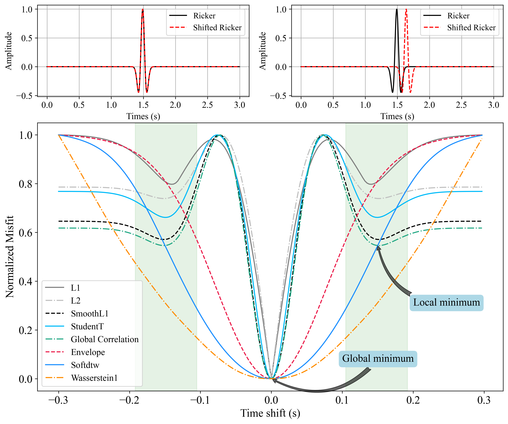
        </td>
    </tr>
    <tr>
        <td style="text-align: center; vertical-align: middle;">L1-norm</td>
        <td style="text-align: center; vertical-align: middle;">✅</td>
        <td style="text-align: center; vertical-align: middle;">
            <a href="./examples/acoustic/02-misfit-functions-test/02-Marmousi2-Test2/02_inversion_L1.py">Example-L1</a>
        </td>
        <td style="text-align: center; vertical-align: middle;">
            
        </td>
    </tr>
    <tr>
        <td style="text-align: center; vertical-align: middle;">L2-norm</td>
        <td style="text-align: center; vertical-align: middle;">✅</td>
        <td style="text-align: center; vertical-align: middle;">
            <a href="./examples/acoustic/02-misfit-functions-test/02-Marmousi2-Test2/02_inversion_L2.py">Example-L2</a>
        </td>
        <td style="text-align: center; vertical-align: middle;">
            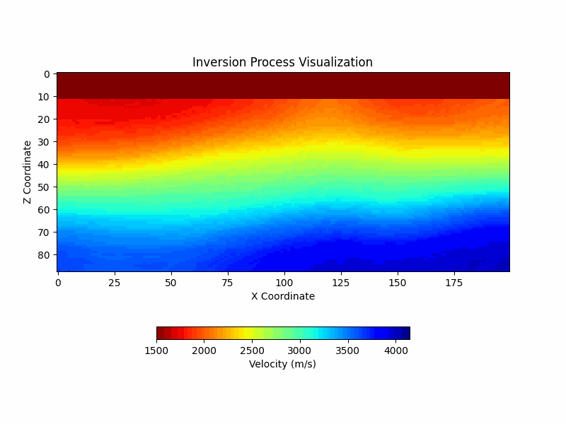
        </td>
    </tr>
    <tr>
        <td style="text-align: center; vertical-align: middle;">T-distribution (StudentT)</td>
        <td style="text-align: center; vertical-align: middle;">✅</td>
        <td style="text-align: center; vertical-align: middle;">
            <a href="./examples/acoustic/02-misfit-functions-test/02-Marmousi2-Test2/02_inversion_StudentT.py">Example-StudentT</a>
        </td>
        <td style="text-align: center; vertical-align: middle;">
            
        </td>
    </tr>
    <tr>
        <td style="text-align: center; vertical-align: middle;">Envelope</td>
        <td style="text-align: center; vertical-align: middle;">✅</td>
        <td style="text-align: center; vertical-align: middle;">
            <a href="./examples/acoustic/02-misfit-functions-test/02-Marmousi2-Test2/02_inversion_Envelope.py">Example-Envelope</a>
        </td>
        <td style="text-align: center; vertical-align: middle;">
            
        </td>
    </tr>
    <tr>
        <td style="text-align: center; vertical-align: middle;">Global Correlation (GC)</td>
        <td style="text-align: center; vertical-align: middle;">✅</td>
        <td style="text-align: center; vertical-align: middle;">
            <a href="./examples/acoustic/02-misfit-functions-test/02-Marmousi2-Test2/02_inversion_GC.py">Example-GC</a>
        </td>
        <td style="text-align: center; vertical-align: middle;">
            
        </td>
    </tr>
    <tr>
        <td style="text-align: center; vertical-align: middle;">Soft Dynamic Time Warping (soft-DTW)</td>
        <td style="text-align: center; vertical-align: middle;">✅</td>
        <td style="text-align: center; vertical-align: middle;">
            <a href="./examples/acoustic/02-misfit-functions-test/02-Marmousi2-Test2/02_inversion_SoftDTW.py">Example-SoftDTW</a>
        </td>
        <td style="text-align: center; vertical-align: middle;">
            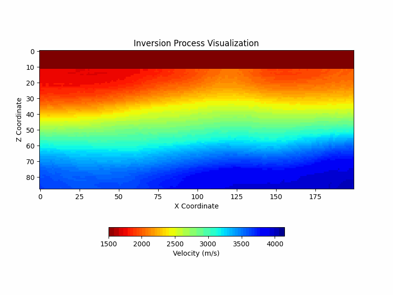
        </td>
    </tr>
    <tr>
        <td style="text-align: center; vertical-align: middle;">Wasserstein Distance with Sinkhorn</td>
        <td style="text-align: center; vertical-align: middle;">✅</td>
        <td style="text-align: center; vertical-align: middle;">
            <a href="./examples/acoustic/02-misfit-functions-test/02-Marmousi2-Test2/02_inversion_WassersteinSinkhorn.py">Example-Wasserstein</a>
        </td>
        <td style="text-align: center; vertical-align: middle;">
            
        </td>
    </tr>
    <tr>
        <td style="text-align: center; vertical-align: middle;">Hybrid Misfit: Envelope & Global Correlation (WECI)</td>
        <td style="text-align: center; vertical-align: middle;">✅</td>
        <td style="text-align: center; vertical-align: middle;">
            <a href="./examples/acoustic/02-misfit-functions-test/02-Marmousi2-Test2/02_inversion_WECI.py">Example-WECI</a>
        </td>
        <td style="text-align: center; vertical-align: middle;">
            
        </td>
    </tr>
</table>


### 4. Optimizer Tests
<table>
    <tr>
        <th style="text-align: center;">Model Test Name</th>
        <th style="text-align: center;">Implemented</th>
        <th style="text-align: center;">Example Path</th>
        <th style="text-align: center;">Example Figure</th>
    </tr>
    <tr>
        <td style="text-align: center; vertical-align: middle;">Stochastic Gradient Descent (SGD)</td>
        <td style="text-align: center; vertical-align: middle;">✅</td>
        <td style="text-align: center; vertical-align: middle;">
            <a href="./examples/acoustic/03-optimizer-test/01-Marmousi2-Test/02_inversion_SGD.py">Example-SGD</a>
        </td>
        <td style="text-align: center; vertical-align: middle;">
            
        </td>
    </tr>
    <tr>
        <td style="text-align: center; vertical-align: middle;">Average Stochastic Gradient Descent (ASGD)</td>
        <td style="text-align: center; vertical-align: middle;">✅</td>
        <td style="text-align: center; vertical-align: middle;">
            <a href="./examples/acoustic/03-optimizer-test/01-Marmousi2-Test/02_inversion_ASGD.py">Example-ASGD</a>
        </td>
        <td style="text-align: center; vertical-align: middle;">
            
        </td>
    </tr>
    <tr>
        <td style="text-align: center; vertical-align: middle;">Root Mean Square Propagation (RMSProp)</td>
        <td style="text-align: center; vertical-align: middle;">✅</td>
        <td style="text-align: center; vertical-align: middle;">
            <a href="./examples/acoustic/03-optimizer-test/01-Marmousi2-Test/02_inversion_RMSProp.py">Example-RMSProp</a>
        </td>
        <td style="text-align: center; vertical-align: middle;">
            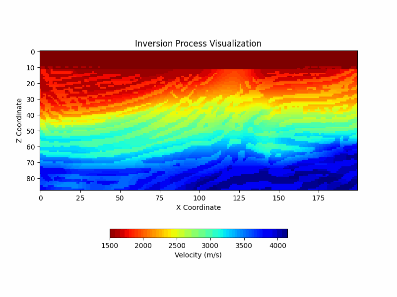
        </td>
    </tr>
    <tr>
        <td style="text-align: center; vertical-align: middle;">Adaptive Gradient Algorithm (Adagrad)</td>
        <td style="text-align: center; vertical-align: middle;">✅</td>
        <td style="text-align: center; vertical-align: middle;">
            <a href="./examples/acoustic/03-optimizer-test/01-Marmousi2-Test/02_inversion_Adagrad.py">Example-Adagrad</a>
        </td>
        <td style="text-align: center; vertical-align: middle;">
            
        </td>
    </tr>
    <tr>
        <td style="text-align: center; vertical-align: middle;">Adaptive Moment Estimation (Adam)</td>
        <td style="text-align: center; vertical-align: middle;">✅</td>
        <td style="text-align: center; vertical-align: middle;">
            <a href="./examples/acoustic/03-optimizer-test/01-Marmousi2-Test/02_inversion_Adam.py">Example-Adam</a>
        </td>
        <td style="text-align: center; vertical-align: middle;">
            
        </td>
    </tr>
    <tr>
        <td style="text-align: center; vertical-align: middle;">Adam with Weight Decay (AdamW)</td>
        <td style="text-align: center; vertical-align: middle;">✅</td>
        <td style="text-align: center; vertical-align: middle;">
            <a href="./examples/acoustic/03-optimizer-test/01-Marmousi2-Test/02_inversion_AdamW.py">Example-AdamW</a>
        </td>
        <td style="text-align: center; vertical-align: middle;">
            
        </td>
    </tr>
    <tr>
        <td style="text-align: center; vertical-align: middle;">Nesterov-accelerated Adam (NAdam)</td>
        <td style="text-align: center; vertical-align: middle;">✅</td>
        <td style="text-align: center; vertical-align: middle;">
            <a href="./examples/acoustic/03-optimizer-test/01-Marmousi2-Test/02_inversion_NAdam.py">Example-NAdam</a>
        </td>
        <td style="text-align: center; vertical-align: middle;">
            
        </td>
    </tr>
    <tr>
        <td style="text-align: center; vertical-align: middle;">Rectified Adam (RAdam)</td>
        <td style="text-align: center; vertical-align: middle;">✅</td>
        <td style="text-align: center; vertical-align: middle;">
            <a href="./examples/acoustic/03-optimizer-test/01-Marmousi2-Test/02_inversion_RAdam.py">Example-RAdam</a>
        </td>
        <td style="text-align: center; vertical-align: middle;">
            
        </td>
    </tr>
</table>

### 5. Regularization Methods

<table>
    <tr>
        <th style="text-align: center;">Model Test Name</th>
        <th style="text-align: center;">Implemented</th>
        <th style="text-align: center;">Example Path</th>
        <th style="text-align: center;">Example Figure</th>
    </tr>
    <tr>
        <td style="text-align: center; vertical-align: middle;">no-regularization</td>
        <td style="text-align: center; vertical-align: middle;">✅</td>
        <td style="text-align: center; vertical-align: middle;">
            <a href="./examples/acoustic/04-regularization-techniques-test/01-Marmousi2-Test/02_inversion_no_regularization.py">no-regular</a>
        </td>
        <td style="text-align: center; vertical-align: middle;">
            
        </td>
    </tr>
    <tr>
        <td style="text-align: center; vertical-align: middle;">Tikhonov-1st Order</td>
        <td style="text-align: center; vertical-align: middle;">✅</td>
        <td style="text-align: center; vertical-align: middle;">
            <a href="./examples/acoustic/04-regularization-techniques-test/01-Marmousi2-Test/02_inversion_Tikhonov-1order.py">Example-Tikhonov1</a>
        </td>
        <td style="text-align: center; vertical-align: middle;">
            
        </td>
    </tr>
    <tr>
        <td style="text-align: center; vertical-align: middle;">Tikhonov-2nd Order</td>
        <td style="text-align: center; vertical-align: middle;">✅</td>
        <td style="text-align: center; vertical-align: middle;">
            <a href="./examples/acoustic/04-regularization-techniques-test/01-Marmousi2-Test/02_inversion_Tikhonov-2order.py">Example-Tikhonov2</a>
        </td>
        <td style="text-align: center; vertical-align: middle;">
            
        </td>
    </tr>
    <tr>
        <td style="text-align: center; vertical-align: middle;">Total Variation-1st Order</td>
        <td style="text-align: center; vertical-align: middle;">✅</td>
        <td style="text-align: center; vertical-align: middle;">
            <a href="./examples/acoustic/04-regularization-techniques-test/01-Marmousi2-Test/02_inversion_TV-1order.py">Example-TV1</a>
        </td>
        <td style="text-align: center; vertical-align: middle;">
            
        </td>
    </tr>
    <tr>
        <td style="text-align: center; vertical-align: middle;">Total Variation-2nd Order</td>
        <td style="text-align: center; vertical-align: middle;">✅</td>
        <td style="text-align: center; vertical-align: middle;">
            <a href="./examples/acoustic/04-regularization-techniques-test/01-Marmousi2-Test/02_inversion_TV-2order.py">Example-TV2</a>
        </td>
        <td style="text-align: center; vertical-align: middle;">
            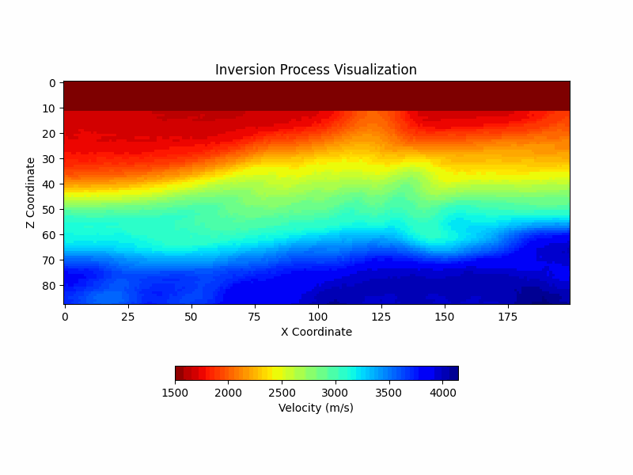
        </td>
    </tr>
</table>


### 6. Deep Image Prior (Earth Model Reparameterization)

<table>
    <tr>
        <th style="text-align: center;">Model Test Name</th>
        <th style="text-align: center;">Implemented</th>
        <th style="text-align: center;">Example Path</th>
        <th style="text-align: center;">Example Figure</th>
    </tr>
    <tr>
        <td style="text-align: center; vertical-align: middle;">no-regularization</td>
        <td style="text-align: center; vertical-align: middle;">✅</td>
        <td style="text-align: center; vertical-align: middle;">
            <a href="./examples/dip/01_Multi-CNN/02_inversion_no_regularization.py">no-regular</a>
        </td>
        <td style="text-align: center; vertical-align: middle;">
            
        </td>
    </tr>
    <tr>
        <td style="text-align: center; vertical-align: middle;">2-Layer CNN</td>
        <td style="text-align: center; vertical-align: middle;">✅</td>
        <td style="text-align: center; vertical-align: middle;">
            <a href="./examples/dip/01_Multi-CNN/02_inversion_2layer-4-32.py">Example-2LayerCNN</a>
        </td>
        <td style="text-align: center; vertical-align: middle;">
            
        </td>
    </tr>
    <tr>
        <td style="text-align: center; vertical-align: middle;">3-Layer CNN</td>
        <td style="text-align: center; vertical-align: middle;">✅</td>
        <td style="text-align: center; vertical-align: middle;">
            <a href="./examples/dip/01_Multi-CNN/02_inversion_3layer-16-32-16.py">Example-3LayerCNN</a>
        </td>
        <td style="text-align: center; vertical-align: middle;">
            
        </td>
    </tr>
    <tr>
        <td style="text-align: center; vertical-align: middle;">3-Layer Unet</td>
        <td style="text-align: center; vertical-align: middle;">✅</td>
        <td style="text-align: center; vertical-align: middle;">
            <a href="./examples/dip/02_Unet/02_inversion_3layer_64channels.py">Example-3LayerUNet</a>
        </td>
        <td style="text-align: center; vertical-align: middle;">
            
        </td>
    </tr>
    <tr>
        <td style="text-align: center; vertical-align: middle;">4-Layer Unet</td>
        <td style="text-align: center; vertical-align: middle;">✅</td>
        <td style="text-align: center; vertical-align: middle;">
            <a href="./examples/dip/02_Unet/02_inversion_4layer_64channels.py">Example-4LayerUNet</a>
        </td>
        <td style="text-align: center; vertical-align: middle;">
            
        </td>
    </tr>
</table>

### 7. Uncertainty Estimation Using Deep Neural Networks (DNNs)

We employ a 2-layered CNN architecture, derived from the Deep Image Prior (DIP) test described earlier, to perform uncertainty estimation. The code can be found [2-layer-CNNs-Uncertainty-Estimation](./examples/dip/01_Multi-CNN/04_uncertainty_assesment.ipynb).The variable `p` represents the dropout ratio applied during both training and inference to evaluate uncertainty.

<div style="text-align: center;">
    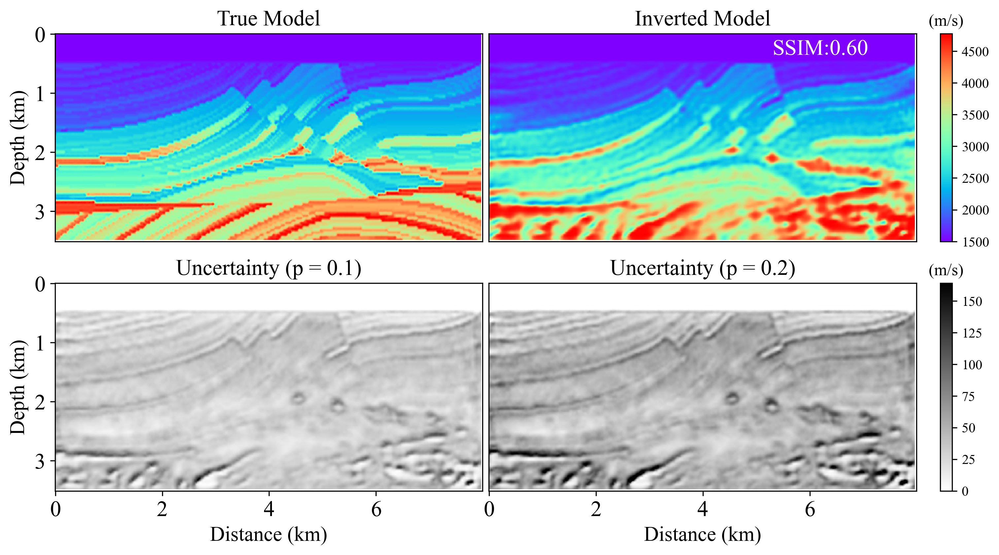
</div>


---

## 📝 Features
- **Multi-Wave Equation**:
  - Iso-Acoustic
  - Iso-Elastic
  - VTI-Elastic
  - TTI-Elastic
- **Various Objective Functions**
  - L1-norm
  - L2-norm
  - Smooth-L1 norm
  - Envelope
  - Global Correlation
  - T-Distribution (StudentT)
  - Soft Dynamic Time Wrapping (SoftDTW)
  - Wasserstein Distance-based with Sinkhorn (Wassrestein)
- **Various Optimization Methods**
  - SGD
  - ASGD
  - RMSProp
  - Adagrad
  - Adam
  - AdamW
  - NAdam
  - RAdam
- **Deep Neural Network Integration**
  - DNNs reparameterize the Earth Model for learnable regularization
  - Droupout for access the inversion uncertainty
- **Resource Management**
  - Mini-batch
  - Checkpointing
- **Robustness and Portability**
  - Each of the method has proposed a code for testing.

---

## ⚖️ LICENSE

The **Automatic Differentiation-Based Full Waveform Inversion (ADFWI)** framework is licensed under the [MIT License](https://opensource.org/licenses/MIT). This license allows you to:

- **Use**: You can use the software for personal, academic, or commercial purposes.
- **Modify**: You can modify the software to suit your needs.
- **Distribute**: You can distribute the original or modified software to others.
- **Private Use**: You can use the software privately without any restrictions.

---

## 🗓️ To-Do List

- <details>
    <summary><b>C++ / C-Based Forward Propagator</b></summary>
    <b>Objective</b>: Develop a forward wave propagation algorithm using C++ or C.  
    
    <b>Explanation</b>: Implementing the forward propagator in lower-level languages like C++ or C will significantly enhance computational performance, particularly for large-scale simulations. The aim is to leverage the improved memory management, faster execution, and more efficient parallel computing capabilities of these languages over Python-based implementations.
  </details>

- <details>
    <summary><b>Resource Optimization for Memory Efficiency</b></summary>
    <b>Objective</b>: Reduce memory consumption for improved resource utilization.  

    <b>Explanation</b>: The current computational framework may encounter memory bottlenecks, especially when processing large datasets. Optimizing memory usage by identifying redundant storage, streamlining data structures, and using efficient algorithms will help in scaling up the computations while maintaining or even enhancing performance. This task is critical for expanding the capacity of the system to handle larger and more complex datasets.
  </details>

- <details>
    <summary><b>Custom Input Data Management System</b></summary>
    <b>Objective</b>: Develop a tailored system for managing input data effectively.  
    
    <b>Explanation</b>: A customized data management framework is needed to better organize, preprocess, and handle input data efficiently. This may involve designing workflows for data formatting, conversion, and pre-processing steps, ensuring the consistency and integrity of input data. Such a system will provide flexibility in managing various input types and scales, and it will be crucial for maintaining control over data quality throughout the project lifecycle.
  </details>

- <details>
    <summary><b>Enhanced Gradient Processing</b></summary>
    <b>Objective</b>: Implement advanced techniques for gradient handling.  

    <b>Explanation</b>: Developing a sophisticated gradient processing strategy will improve the inversion results by ensuring that gradients are effectively utilized and interpreted. This may include techniques such as gradient clipping, adaptive learning rates, and noise reduction methods to enhance the stability and convergence of the optimization process, ultimately leading to more accurate inversion outcomes.
  </details>

- <details>
    <summary><b>Multi-Scale Inversion Strategies</b></summary>
    <b>Objective</b>: Introduce multi-scale approaches for improved inversion accuracy. 

    <b>Explanation</b>: Multi-scale inversion involves processing data at various scales to capture both large-scale trends and small-scale features effectively. Implementing this strategy will enhance the robustness of the inversion process, allowing for better resolution of subsurface structures. Techniques such as hierarchical modeling and wavelet analysis may be considered to achieve this goal, thus improving the overall quality of the inversion results.
  </details>

- <details>
    <summary><b>Real Data Testing</b></summary>
    <b>Objective</b>: Evaluate the performance and robustness of the developed methodologies using real-world datasets.  
    <b>Explanation</b>: Conducting tests with actual data is crucial for validating the effectiveness of the implemented algorithms. This will involve the following steps:
    
    1. <b>Dataset Selection</b>: Identify relevant real-world datasets that reflect the complexities of the target applications. These datasets should include diverse scenarios and noise characteristics typical in field data.

    2. <b>Preprocessing</b>: Apply necessary preprocessing techniques to ensure data quality and consistency. This may include data normalization, filtering, and handling missing or corrupted values.

    3. <b>Implementation</b>: Utilize the developed algorithms on the selected datasets, monitoring their performance metrics such as accuracy, computational efficiency, and convergence behavior.

    4. <b>Comparison</b>: Compare the results obtained from the implemented methods against established benchmarks or existing methodologies to assess improvements.

    5. <b>Analysis</b>: Analyze the outcomes to identify strengths and weaknesses, and document any discrepancies or unexpected behaviors. This analysis will help refine the algorithms and inform future iterations.

    6. <b>Reporting</b>: Summarize the findings in a comprehensive report, detailing the testing procedures, results, and any implications for future work.

    This actual data testing phase is essential for ensuring that the developed methodologies not only perform well in controlled environments but also translate effectively to real-world applications. It serves as a critical validation step before broader deployment and adoption.
  </details>

---
## 🔰 Contact

Developed by **Feng Liu** at the University of Science and Technology of China (USTC) and Shanghai Jiao Tong University (SJTU).

The related paper ***Full Waveform Inversion of (An)Isotropic Wave Physics in a Versatile Deep Learning Framework*** is currently in preparation.

For any inquiries, please contact Liu Feng via email at: [liufeng2317@sjtu.edu.cn](mailto:liufeng2317@sjtu.edu.cn) or [liufeng2317@mail.ustc.edu.cn](mailto:liufeng2317@mail.ustc.edu.cn).


```bibtex
@software{LiuFeng,
  author       = {Feng Liu, Haipeng Li, GuangYuan Zou and Junlun Li},
  title        = {ADFWI},
  month        = July,
  year         = 2024,
  version      = {v1.0},
}
```