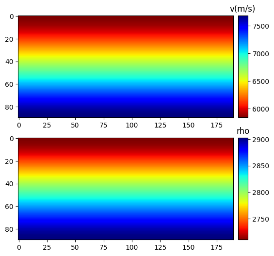

<!--
 * @Author: LiuFeng(USTC) : liufeng2317@mail.ustc.edu.cn
 * @Date: 2023-07-03 11:16:43
 * @LastEditors: LiuFeng
 * @LastEditTime: 2024-01-02 21:27:32
 * @FilePath: /TorchInversion/README.md
 * @Description: 
 * Copyright (c) 2023 by ${git_name} email: ${git_email}, All Rights Reserved.
-->

## Torch Waveform Inversion
**TorchInversion** is a powerful PyTorch-based framework that enables the development of a **2-D Acoustic Wave Propagator**, specifically designed for seismic imaging and inversion applications. By leveraging TorchInversion, users gain access to a versatile toolset that simplifies the experimentation process and harnesses the capabilities of PyTorch's **automatic differentiation**.

****
### Key Features

* **2-D Acoustic Wave Propagator**: TorchInversion empowers users to construct a robust and efficient 2-D Acoustic Wave Propagator, allowing for accurate simulations and computations in seismic imaging and inversion tasks.

* **Seamless Integration with Traditional Inversion Framework**: TorchInversion seamlessly integrates with traditional inversion frameworks, offering the flexibility to set any type of misfit function. Users can define their own custom misfit functions and obtain accurate gradients through TorchInversion. This capability enhances the versatility and adaptability of the inversion process, accommodating a wide range of use cases.

* **Integration with Physics-Based Deep Learning Framework**: TorchInversion can be seamlessly incorporated as a part of a physics-based deep learning framework for gradient backpropagation. It can be directly interfaced with neural networks, enabling researchers to combine the power of deep learning with physics-based simulations. This integration facilitates advanced research work in related domains.

* **Automated Inversion Operations**: We have integrated SWIT's associated gradient post-processing operations, optimization methods, and other functionalities into TorchInversion. This integration allows for automated inversion operations, streamlining the entire process from data processing to inversion results.

****
### Performance Validation

* **Accuracy of the gradient**: To ensure the accuracy and reliability of TorchInversion, extensive performance validation was conducted. We compared the gradients generated by our propagator against those of the well-established open-source library **SWIT 1.0**(https://github.com/Haipeng-ustc/SWIT-1.0) and the numerical results (Perturbation Test). The results demonstrated that TorchInversion's gradients exhibit an error within 1/1000 of the reference library's gradients. This validation provides confidence in the accuracy and fidelity of the TorchInversion framework.


* **Computational velocity:** we also focused on computational efficiency. By leveraging PyTorch's capabilities, we modified all calculations to matrix operations and added a dimension to the gun records. This optimization allowed us to achieve comparable computational efficiency to that of the Fortran implementation in SWIT 1.0. TorchInversion's ability to harness the computational power of modern hardware ensures fast and efficient processing, enabling seamless integration into various workflows.

****
### Gradient Test
<!-- The Gradient Test -->
<details>
<summary><strong>Gradient Test Result</strong></summary>

In a 50*50 homogeneous model (v=3000m/s) set the velocity at the center point to 3030m/s. Solve for the numerical gradient by perturbing the velocity at each point. The red line in the figure below shows the distribution of the numerical gradient along the black dashed line. The black and blue solid lines represent the gradients solved by AD and SWIT.

<div align=center> </div>

<div align=center> </div>

The results illustrate that 
* (1) **Automatic Differentiation can obtain accurate gradients** 
* (2) **The gradient solved by AD and the gradient solved by the concomitant state method agree within numerical accuracy**

</details>

### Case Stydy for FWI

<!-- the Lyaer Model -->

<details>
<summary><strong>Layer Model</strong></summary>

Details of this example can be found in [Layer Model forward](./example/layerModel/01_for_layer.ipynb) and [Layer Model inversion](./example/layerModel/02_inv_layer_adam.ipynb)

* The **true model** and some setting of the model:
<div align="center"></div>

* The **wavelet** and the **dampling** setting
<div float="left" align="center"> </div>

* **Initial model** and **inversion result**
<div align="center"> </div>

It is important to note that we have not been particularly careful in adjusting the update parameters and processing the gradients in detail, but there are many details in the FWI work that can greatly improve the effectiveness and efficiency of the inversion

</details>

<!-- the Anomaly Layer Model -->

<details>
<summary><strong>Anomaly Layer Model</strong></summary>

Details of this example can be found in [Layer Anomaly Model forward](./example/layerAnomaly/01_for_layer.ipynb) and [Layer Anomaly Model inversion](./example/layerAnomaly/02_inv_layer_adam.ipynb)

* The **true model** and some setting of the model:
<div align="center"></div>

* The **wavelet** and the **dampling** setting
<div float="left" align="center"> </div>

* **Initial model** and **inversion result**
<div align="center">  
 </div>

</details>


<!-- Marmousi2 Model -->

<details>
<summary><strong>Marmousi Model</strong></summary>

Details of this example can be found in [Marmousi Model forward](./example/marmousi2Model/01_for_layer.ipynb) and [Marmousi Model inversion](./example/marmousi2Model/02_inv_layer_adam.ipynb)

* The **true model** and some setting of the model:
<div align="center"></div>

* The **wavelet** and the **dampling** setting
<div float="left" align="center"> </div>

* **Initial model** and **inversion result**
<div align="center"></div>

</details>

****
### Usage
You can simply clone the project and follow the example in the demo.


### Contact
 Liu Feng @ USTC, Email: liufeng2317@mail.ustc.edu.cn

```python
@software{LiuFeng2317,
  author       = {Feng Liu, GuangYuan Zou},
  title        = {TorchInversion},
  month        = July,
  year         = 2023,
  version      = {v0.1},
}
```
