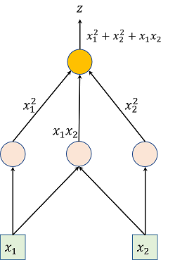

# Automatic Differentiation

Automatic Differentiation (AD) is an efficient and error-free approach for gradient calculation which has been widely used in computational fluid dynamics, atmospheric science, deep learning. By replacing the variables' domains and redefining the semantics of the operators in the forward pass, which are also referred to as the computational graph in deep learning, AD performs a non-standard interpretation of the forward simulation to incorporate and propagate derivatives according to the chain rule. 

## Computational Graph (CG)

A **computational graph** is a directed acyclic graph (DAG) where:
- **Nodes** represent operations (e.g., addition, multiplication, etc.).
- **Edges** represent dependencies between operations, specifically the flow of data (i.e., inputs and outputs).

In a computational graph, each node computes an intermediate value, and the edges define how these values are combined. AD uses this graph to compute derivatives by applying the chain rule to propagate derivatives through the operations.

For example, for a function {math}`z = x_1^2 + x_2^2 + x_1 x_2`, the computational graph could be:

<!-- <div align="center">
  
</div> -->


Where the arrows represent data flow and the nodes represent operations.

## Automatic Differentiation (AD)

AD is a method for evaluating derivatives of functions that are represented as computational graphs. It is distinct from numerical differentiation (which approximates derivatives using finite differences) and symbolic differentiation (which calculates derivatives symbolically). The two primary modes of AD are **forward mode** and **reverse mode**. Each mode has its own advantages, depending on the structure of the function being differentiated. Both of these two modes exact derivatives by applying the chain rule systematically to each operation in the graph:

```{math}
\frac{\partial f\circ g (x)}{\partial x} = \frac{\partial f'\circ g(x)}{\partial g} {\frac{\partial g'(x)}{\partial x}}.
```


A detailed and intuitive AD for Forward and Inverse Mode can be found at: 
* [Automatic Differentiation (Wikipedia)](https://en.wikipedia.org/wiki/Automatic_differentiation)
* [ADCME: Computational Graph, Automatic Differentiation (Software)](https://kailaix.github.io/ADCME.jl/latest/tu_whatis/)
* [Multimodal surface wave inversion with automatic differentiation (Article)](https://academic.oup.com/gji/article/238/1/290/7659841)


## PyTorch Framework

**PyTorch** is one of the most popular deep learning frameworks that provides automatic differentiation through its `autograd` module. PyTorch primarily uses **reverse-mode AD**, which is well-suited for neural networks where there are many inputs (weights) and a single output (loss). Key Features of PyTorch’s `autograd`:

1. **Tensors and Gradients**: In PyTorch, a **tensor** is an n-dimensional array. Tensors can be tracked for gradients by setting the `requires_grad=True` flag. Once the operations are performed, the framework can automatically compute the gradient for each tensor during backpropagation.
   
2. **Computational Graph**: PyTorch builds a dynamic computational graph (define-by-run), which means the graph is created as operations are executed. This allows for flexible, dynamic changes to the graph structure, which is ideal for tasks like variable-length sequences in neural networks.

3. **Backpropagation**: Once the forward pass is complete, PyTorch uses the **reverse-mode AD** to compute the gradients via backpropagation. The gradients are stored in the `grad` attribute of the tensor.

4. **Autograd API**: PyTorch provides an intuitive API to compute gradients automatically. For example, after defining a tensor, computing the loss, and performing backpropagation:

```python
import torch

# Create tensor and enable gradient tracking
x = torch.ones(2, 2, requires_grad=True)

# Perform a simple operation
y = x + 2
z = y * y * 3

# Compute the sum
out = z.mean()

# Perform backward pass (compute gradients)
out.backward()

# Get gradients of x
print(x.grad)  # Gradient of x
```

5. **Autograd Context**: In PyTorch, gradients are computed inside a context (such as within a with `torch.no_grad()` block for disabling gradient tracking during inference), which helps in optimizing memory usage during inference.