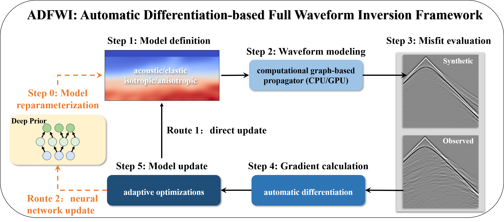
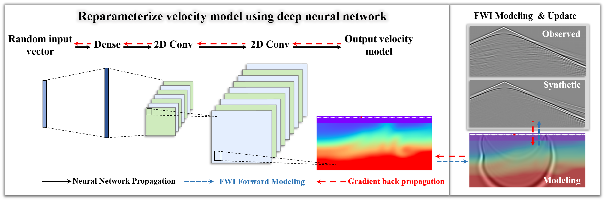

# Overview

## Introduction
&emsp;&emsp;**ADFWI** is an open-source framework for high-resolution subsurface parameter estimation by minimizing discrepancies between observed and simulated waveform. Utilizing automatic differentiation (AD), ADFWI **simplifies the derivation and implementation of full waveform inversion (FWI)**, enhancing the design and evaluation of methodologies. It supports wave propagation in various media, including isotropic acoustic, isotropic elastic, and both vertical transverse isotropy (VTI) and horizontal transverse isotropy (HTI) medias.

&emsp;&emsp;In addition, **ADFWI** provides a comprehensive collection of **Objective functions**, **regularization techniques**, **optimization algorithms**, and **deep neural networks**. This rich set of tools facilitates researchers in conducting experiments and comparisons, enabling them to explore innovative approaches and refine their methodologies effectively.




## Features  

- **Automatic Differentiation for Gradient Computation**  
  Eliminates manual adjoint-state derivation by leveraging automatic differentiation (AD) for efficient gradient computation.  

- **Versatile Wave Propagation Models**  
  Supports isotropic acoustic, isotropic elastic, and anisotropic (VTI & HTI) wave simulations for broader subsurface imaging applications.  

- **Modular and Customizable**  
  Easily integrates custom objective functions, regularization techniques, optimization algorithms, and deep neural networks for flexible method development.  

- **Advanced Optimization and Regularization**  
  Includes L-BFGS, Adam, SGD, total variation, sparsity constraints, and physics-guided priors for stable and robust inversion.  

- **Deep Learning Integration**  
  Supports deep priors, learned regularization, and uncertainty quantification, enhancing traditional FWI approaches.  

- **Benchmark Datasets and Reproducibility**  
  Provides ready-to-use datasets (Marmousi2, Overthrust) for standardized evaluation and comparison.  

- **Open-Source and Extensible**  
  Encourages community contributions, allowing researchers to expand functionalities and adapt ADFWI to novel FWI challenges.  

<!-- * **Scalable and Efficient Computation**
ADFWI is optimized for high-performance computing, supporting multi-GPU acceleration and efficient memory management, making it suitable for large-scale FWI applications. -->

## Installation

To install ADFWI, please follow these steps:

1. **Ensure Prerequisites**  
   - **Python 3.8+**: [Python Downloads](https://www.python.org/downloads/).

2. **Create a Virtual Environment (Optional)**
   It is recommended to create a virtual environment using `conda`:
   ```bash
   conda create --name adfwi-env python=3.8
   conda activate adfwi-env
   ```

3. **Install Required Packages**
- Method 1: **Clone the github Repository**
  This method provides the latest version, which may be more suitable for your research:
    ```bash
    git clone https://github.com/liufeng2317/ADFWI.git
    cd ADFWI
    ```
    Then, install the necessary packages:
    ```bash
    pip install -r requirements.txt
    ```
- Method 2: Install via pip
  Alternatively, you can directly install ADFWI from PyPI:
  ```bash
    pip install ADFWI-Torch
  ```