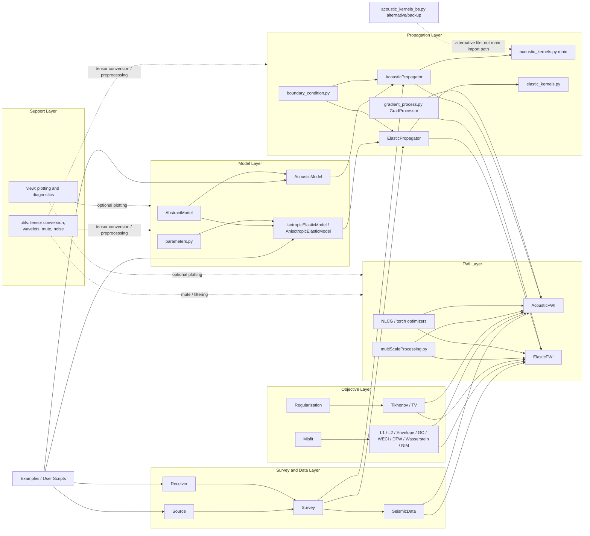

# ADFWI v1.1 Code Graph

This document records the core ADFWI code structure before the `bv1.2` backend
and device-dispatch refactor. It is intended as a visual reference for later
changes.

Generated on: 2026-05-23

## Scope

Included:

- ADFWI physical forward modeling and backpropagation path
- acoustic and elastic model classes
- acoustic and elastic propagators and kernels
- FWI loops
- misfit, regularization, optimizer, gradient processing
- survey, seismic data, utilities, and visualization dependencies

Excluded for the first `bv1.2` backend phase:

- `ADFWI/dip`
- DR-FWI examples and neural-network reparameterization workflows
- DIP/CNN/MLP/UNet model components

## Validation Notes

This graph was checked against the v1.1 source files before the `bv1.2` backend refactor:

- `AcousticPropagator` imports `forward_kernel` from `ADFWI/propagator/acoustic_kernels.py`.
- `acoustic_kernels_bs.py` is present, but it is not imported by `AcousticPropagator` in the v1.1 main path.
- `ElasticPropagator` imports `forward_kernel` from `ADFWI/propagator/elastic_kernels.py`.
- `AcousticFWI` and `ElasticFWI` both own the inversion loop, data masking, waveform preprocessing, loss calculation, regularization, gradient processing, optimizer stepping, and result caching.
- `GradProcessor` currently crosses to CPU NumPy/SciPy for smoothing, tapering, and illumination-based processing before moving gradients back to the active torch device.
- Device handling in v1.1 is explicit and distributed: models, propagators, regularization objects, kernels, and FWI classes each receive or store device information separately.

## High-Level Module Graph



## Acoustic FWI Forward/Backward Sequence

```mermaid
sequenceDiagram
    participant User as User Script
    participant Model as AcousticModel
    participant Survey as Survey / SeismicData
    participant Prop as AcousticPropagator
    participant Kernel as acoustic forward_kernel
    participant FWI as AcousticFWI
    participant Misfit as Misfit
    participant Reg as Regularization
    participant Grad as GradProcessor
    participant Opt as Optimizer / Scheduler

    User->>Model: create vp/rho parameters
    User->>Survey: create Source, Receiver, Survey
    User->>Prop: bind Model + Survey + device
    User->>FWI: bind Propagator, Model, obs_data, loss, optimizer

    loop iteration
        FWI->>Opt: zero_grad()
        loop shot batch
            FWI->>Prop: forward(shot_index, checkpoint_segments)
            Prop->>Model: forward() / clip bounds / update derived params
            Prop->>Kernel: forward_kernel(..., model tensors, device, dtype)
            Kernel-->>Prop: recorded waveforms + forward wavefield summaries
            Prop-->>FWI: record_waveform dict
            FWI->>FWI: receiver mask / data mask / mute / low-pass / normalize
            FWI->>Misfit: loss(synthetic, observed)
            Misfit-->>FWI: data_loss
            FWI->>Reg: regularization(model parameters)
            Reg-->>FWI: regularization_loss
            FWI->>FWI: loss = data_loss + regularization_loss
            FWI->>FWI: loss.backward()
        end
        FWI->>Grad: process gradients with mute/smooth/illumination
        Grad-->>FWI: processed parameter gradients
        FWI->>Opt: step()
        FWI->>Opt: scheduler.step()
        FWI->>Model: forward() / enforce bounds
        FWI->>FWI: cache loss, model, optional figures
    end
```

## Elastic FWI Forward/Backward Sequence

```mermaid
sequenceDiagram
    participant User as User Script
    participant Model as Elastic / Anisotropic Model
    participant Survey as Survey / SeismicData
    participant Prop as ElasticPropagator
    participant Kernel as elastic forward_kernel
    participant FWI as ElasticFWI
    participant Misfit as Misfit
    participant Reg as Regularization
    participant Grad as GradProcessor
    participant Opt as Optimizer / Scheduler

    User->>Model: create vp/vs/rho or anisotropic parameters
    User->>Survey: create Source, Receiver, Survey
    User->>Prop: bind Model + Survey + device
    User->>FWI: bind Propagator, Model, obs_data, loss, optimizer

    loop iteration
        FWI->>Opt: zero_grad()
        loop shot batch
            FWI->>Prop: forward(shot_index, fd_order, checkpoint_segments)
            Prop->>Model: forward() / compute elastic moduli
            Prop->>Kernel: forward_kernel(..., lamu, lam, bx, bz, CC, device, dtype)
            Kernel-->>Prop: txx/tzz/txz/vx/vz records + wavefield summaries
            Prop-->>FWI: record_waveform dict
            FWI->>FWI: pressure/vx/vz extraction, masks, mute, low-pass, normalize
            FWI->>Misfit: loss per selected component
            Misfit-->>FWI: data_loss
            FWI->>Reg: regularization(model parameters)
            Reg-->>FWI: regularization_loss
            FWI->>FWI: loss.backward()
        end
        FWI->>Grad: process gradients per active parameter
        FWI->>Opt: step()
        FWI->>Opt: scheduler.step()
        FWI->>Model: forward() / enforce bounds
        FWI->>FWI: cache loss, model, optional figures
    end
```

## Current Device Flow in v1.1

```mermaid
graph TD
    UserDevice[User passes device string]
    ModelDevice[Model stores self.device]
    PropDevice[Propagator stores self.device]
    FWIDevice[FWI copies propagator.device]
    RegDevice[Regularization stores device]
    KernelDevice[Kernel receives device]
    TensorTo[Tensor creation and tensor.to(device)]
    CPUBridge[.cpu().detach().numpy() bridge]

    UserDevice --> ModelDevice
    UserDevice --> PropDevice
    UserDevice --> RegDevice
    PropDevice --> FWIDevice
    PropDevice --> KernelDevice
    ModelDevice --> TensorTo
    PropDevice --> TensorTo
    RegDevice --> TensorTo
    KernelDevice --> TensorTo
    TensorTo --> CPUBridge

    CPUBridge --> BoundaryCPU[Boundary and empirical updates often use NumPy]
    CPUBridge --> GradCPU[Gradient processing uses NumPy / SciPy]
    CPUBridge --> CacheCPU[Result cache and plotting use NumPy]
```

## Proposed bv1.2 Backend Insertion Points

```mermaid
graph LR
    subgraph BackendLayer[New ADFWI/backends]
        Configure[configure_backend: cpu, cuda:0, npu:0]
        Context[get_backend() / use_backend()]
        Device[backend.device]
        DType[backend.dtype]
        TensorFactory[tensor helpers]
        Sync[backend.synchronize()]
        Diagnostics[backend diagnostics]
    end

    subgraph CurrentCore[v1.1 Core ADFWI]
        Model[Model classes]
        Propagator[Propagators]
        Kernels[Kernels]
        FWI[FWI loops]
        Misfit[Misfits]
        Regularization[Regularization]
        Grad[Gradient processing]
        Bench[Benchmarks / Tests]
    end

    Configure --> Context
    Context --> Device
    Context --> DType
    Context --> TensorFactory
    Context --> Sync
    Context --> Diagnostics

    Device --> Model
    Device --> Propagator
    Device --> Kernels
    Device --> FWI
    Device --> Misfit
    Device --> Regularization
    Device --> Grad
    Device --> Bench

    TensorFactory --> Model
    TensorFactory --> Propagator
    TensorFactory --> Kernels
    TensorFactory --> Regularization
    Diagnostics --> Bench
```

## Refactor Hotspots for Unified Device Dispatch

| Area | v1.1 behavior | bv1.2 refactor target |
| --- | --- | --- |
| Model constructors | `device='cpu'` default in model classes | allow `device=None`, inherit from `get_backend()` |
| Propagator constructors | `device='cpu'`, `cpu_num`, `gpu_num` passed directly | use backend object for device and future accelerator metadata |
| Kernel functions | receive raw `device` and `dtype` | keep explicit kernel args initially, but feed them from backend consistently |
| FWI classes | copy `self.propagator.device` and manually move observed data | use backend-aware tensor conversion and diagnostics |
| Regularization | creates derivative operators on passed device | inherit backend default unless explicitly overridden |
| Misfits | mostly use `obs.device` or `syn.device` | preserve tensor-local behavior; avoid backend-specific branches |
| Gradient processing | moves gradients to CPU NumPy/SciPy for smoothing and illumination | document CPU bridge; later evaluate NPU-safe alternatives |
| Plot/cache utilities | use CPU NumPy arrays | keep CPU bridge explicit and isolated |

## Notes for Future Modifications

1. Preserve current explicit `device=` behavior during migration.
2. Add backend defaults gradually, starting from acoustic forward smoke tests.
3. Avoid editing finite-difference kernels for NPU before backend resolution,
   diagnostics, and tests exist.
4. Treat `.cpu().detach().numpy()` transitions as explicit CPU bridges. They are
   acceptable for plotting, caching, and some preprocessing, but should be easy to
   locate when optimizing NPU execution.
5. Keep DR-FWI and DIP paths out of the first backend compatibility phase.
