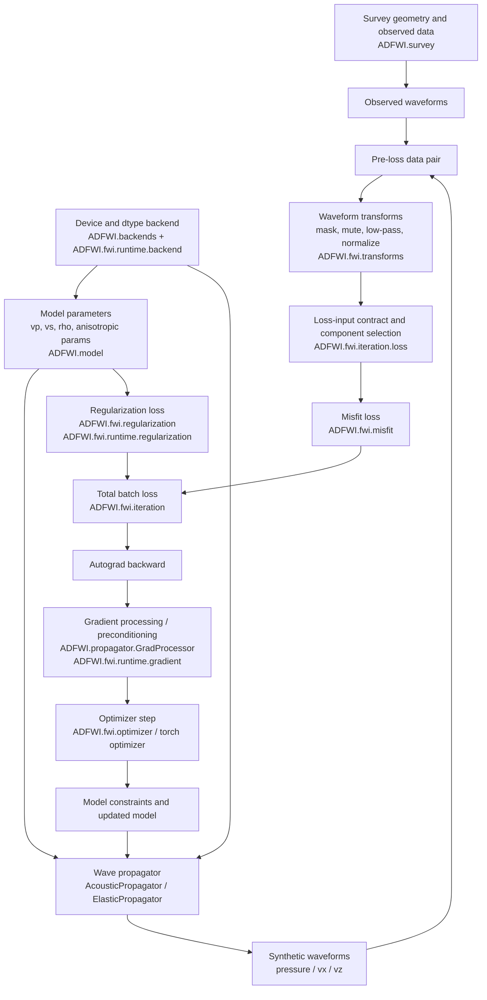

# 33. FWI Module Map for Geophysical Users

## Purpose

This document maps the current `ADFWI.fwi` organization to the physical and algorithmic flow of full waveform inversion. The goal is to keep future refactors readable for geophysical researchers, not only for software maintainers.

The main rule is:

> `acoustic_fwi.py` and `elastic_fwi.py` should preserve the inversion story line, while shared details move into physically meaningful helper modules.

## Physical Flow

## Module Responsibilities

| Module | Research meaning | Current responsibility |
| --- | --- | --- |
| `ADFWI/fwi/acoustic_fwi.py` | Acoustic FWI experiment driver | Keeps the acoustic inversion loop visible: forward modeling, loss, backward, gradient processing, optimizer update, cache. |
| `ADFWI/fwi/elastic_fwi.py` | Elastic/anisotropic FWI experiment driver | Keeps the elastic inversion loop visible, including pressure/vx/vz component selection and elastic parameter updates. |
| `ADFWI/fwi/iteration/loss.py` | Data entering the objective function | Builds synthetic/observed loss inputs, applies receiver/data masks, selects elastic components, combines weighted component losses, and dispatches misfit evaluation. |
| `ADFWI/fwi/transforms/` | Seismic waveform preprocessing | Encodes trace normalization, receiver masking, data masks, offset mute, first-arrival mute, and low-pass transforms. |
| `ADFWI/fwi/misfit/` | Data misfit definition | Defines objective functions such as L2, Wasserstein, StudentT, SoftDTW, and travel-time style losses. |
| `ADFWI/fwi/regularization/` | Model prior / smoothness constraint | Defines model-space penalties used together with data misfit. |
| `ADFWI/fwi/iteration/` | Inversion bookkeeping | Encodes batch ranges, batch loss tensor/scalar handling, and progress descriptions. |
| `ADFWI/fwi/runtime/` | Shared execution rules | Holds acoustic/elastic shared runtime helpers: backend checks, regularization dispatch, gradient processor dispatch. It should not introduce new physics. |
| `ADFWI/fwi/multiscale/` | Multiscale inversion strategy | Owns legacy low-pass filtering helpers used by frequency-continuation style workflows; use this path for legacy-compatible FWI filtering, and treat pure torch low-pass as a deliberate numerical-method change. |
| `ADFWI/backends/` | Device and dtype policy | Selects and describes CPU/CUDA/NPU execution backend for user-facing device control. |

## Current Design Assessment

The current split is physically reasonable because it follows the FWI chain:

1. model and survey define the experiment;
2. propagator generates synthetic data;
3. transforms and iteration loss helpers prepare observed and synthetic waveforms consistently;
4. misfit and regularization define the objective;
5. autograd computes gradients;
6. gradient processors apply geophysical preconditioning;
7. optimizer updates model parameters.

This organization helps researchers locate the right layer:

- change a waveform mute or filter: use `fwi.transforms`;
- change observed/synthetic pairing or elastic component weights: use `fwi.iteration.loss`; physical component ownership stays in `acoustic_fwi.py` and `elastic_fwi.py`;
- change the objective function: use `fwi.misfit` or `fwi.regularization`;
- change the inversion schedule or batching: use `fwi.iteration`;
- change backend/device behavior: use `ADFWI.backends` and `fwi.runtime.backend`;
- inspect the full inversion algorithm: read `acoustic_fwi.py` or `elastic_fwi.py`.

## Boundaries to Preserve

- Keep `acoustic_fwi.py` and `elastic_fwi.py` as readable algorithm drivers. Do not hide the complete inversion loop behind too many nested helpers.
- Keep `runtime` as execution glue only. It may reduce acoustic/elastic duplication, but it should not own physical modeling assumptions.
- Keep waveform operations in `transforms` when they act on seismic traces before loss calculation.
- Keep loss-input and component bookkeeping in `iteration.loss` when it decides which synthetic/observed tensors enter the loss.
- Keep numerical behavior fixed unless a validation document explicitly accepts a new tolerance or formula.

## Recommended Next Refactor Direction

The next optimization should continue from the same principle: remove duplication only where the physical meaning remains clear.

Recommended candidates:

1. Cache/result bookkeeping: extract shared save-list append logic only if the public FWI drivers remain easy to read.
2. Gradient processing documentation: document how `GradProcessor` uses forward wavefields and why this remains CPU NumPy based for compatibility.
3. Elastic component workflow: add a short user-facing example showing pressure-only vs pressure/vx/vz inversion, because this is a geophysical choice rather than only a code option.
4. Runtime naming guardrail: keep `runtime` helpers small and well documented so researchers understand they are shared execution utilities, not new physical operators.

## Validation Expectation

For every structural refactor that touches this map:

- preserve existing public imports where possible;
- add focused unit tests for the moved helper;
- run acoustic and elastic smoke comparisons on CPU/NPU when the change touches data, gradient, regularization, backend, or loop behavior;
- record numerical drift in the corresponding `bv1.2` document.
