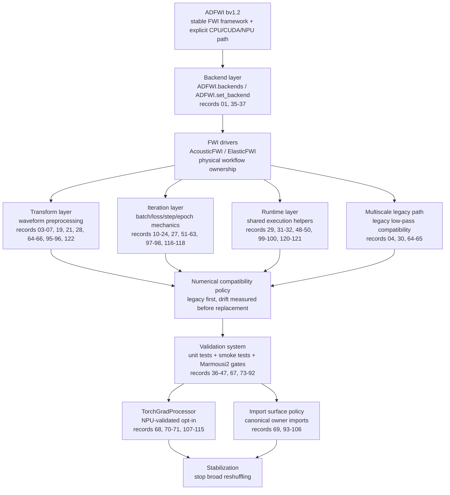

# ADFWI bv1.2 Optimization Chain

This document summarizes the `bv1.2` optimization branch from architecture-level
goals down to concrete code surfaces. Detailed per-step records remain in
`docs/version-plans/bv1.2/`.

## Executive Summary

`bv1.2` is now in a **closeout/stabilization phase**. The main work is no
longer broad cleanup; the framework has already been reorganized around
explicit ownership:

- `ADFWI.backends` owns backend/device/dtype selection.
- `ADFWI.fwi.transforms` owns waveform preprocessing.
- `ADFWI.fwi.iteration` owns FWI iteration mechanics: batches, loss preparation,
  one-batch steps, and epoch updates.
- `ADFWI.fwi.runtime` owns shared driver execution mechanics: backend guards,
  forward records, wavefield accumulation, gradient dispatch, regularization,
  and cache bookkeeping.
- `ADFWI.fwi.multiscale` owns the explicit legacy low-pass path.
- `AcousticFWI` and `ElasticFWI` remain the physical workflow owners: model
  parameter order, inversion components, loss components, and user-facing FWI
  configuration.

The former `ADFWI.fwi.data` helper layer was removed because it did not represent
data objects. Its useful pieces now live in `ADFWI.fwi.iteration.loss`, where
they belong: loss-input construction, transform context, misfit dispatch, and
weighted component loss assembly.

For future navigation, use:

- [135 - bv1.2 Closeout Summary](./135-bv12-closeout-summary.md) for final
  branch status and stop criteria;
- [Archive Index](./archive-index.md) for grouped access to the detailed
  numbered records.

## Top-Down Architecture



## Major Optimization Areas

| Area | Main Change | Current Contract |
| --- | --- | --- |
| Backend unification | Added shared backend configuration, diagnostics, and FWI constructor guards. | Configure CPU/CUDA/NPU once before constructing models, propagators, and FWI drivers. |
| FWI transforms | Centralized normalization, masks, mute, receiver matching, and low-pass filtering. | Receiver selection runs before transform pipelines; most transforms preserve synthetic/observed shape. |
| FWI iteration | Extracted repeated batch, loss, step, and epoch mechanics from acoustic/elastic loops. | `iteration` owns inversion mechanics, not physical model semantics. |
| Former data helpers | Removed the misleading `fwi.data` layer and merged useful helpers into `iteration.loss`. | Loss-input pairing and transform execution are part of iteration loss construction. |
| FWI runtime | Extracted shared execution helpers for backend alignment, cache, forward records, wavefields, gradients, and regularization. | `runtime` is shared driver mechanics, not a standalone forward/inversion framework. Do not keep splitting it. |
| Multiscale | Moved legacy low-pass into an explicit `multiscale` package. | Legacy low-pass stays available and explicit because it is a numerical compatibility path. |
| Driver ownership | Moved elastic loss components and acoustic/elastic parameter order back into drivers. | `AcousticFWI` / `ElasticFWI` own physical fields, components, and user-facing configuration. |
| Compatibility cleanup | Removed thin shims and broad re-export surfaces after canonical owner imports were established. | `bv1.2` uses canonical imports; `bv1.1` remains the legacy compatibility branch. |
| Torch gradient path | Added and validated `TorchGradProcessor`. | NPU-validated opt-in path; legacy `GradProcessor` remains the default. |
| Real-case validation | Added Marmousi2 full-case output artifacts, preset runner, comparison CLI, and profiling option. | Fixed shot3/shot5 NPU gates are the reference checks for concrete future changes. |

## Code Ownership Map

| Path | Owner Role | Should Not Own |
| --- | --- | --- |
| `ADFWI/backends/` | Backend/device/dtype configuration and diagnostics. | FWI physics or inversion loop logic. |
| `ADFWI/fwi/acoustic_fwi.py` | Acoustic FWI user entry point and acoustic physical choices. | Generic transform, runtime, or iteration helper internals. |
| `ADFWI/fwi/elastic_fwi.py` | Elastic FWI user entry point, elastic components, parameter order, and anisotropic choices. | Generic transform, runtime, or iteration helper internals. |
| `ADFWI/fwi/transforms/` | Waveform preprocessing API. | Optimizer steps, model updates, or FWI physical parameter order. |
| `ADFWI/fwi/iteration/batches.py` | Shot batch scheduling and batch labels. | Loss formulas or backend management. |
| `ADFWI/fwi/iteration/loss.py` | Loss-input records, transform context, receiver/data pair preparation, component selection, misfit dispatch, and weighted loss accumulation. | Propagator execution, optimizer stepping, or physical parameter ownership. |
| `ADFWI/fwi/iteration/step.py` | One-batch acoustic/elastic forward-loss-backward execution. | Epoch update policy or long-term cache ownership. |
| `ADFWI/fwi/iteration/epoch.py` | Optimizer/scheduler/model constraint update and epoch finalization. | Component loss construction. |
| `ADFWI/fwi/runtime/backend.py` | Construction-time backend/device alignment. | Backend selection policy or iteration-time tensor movement. |
| `ADFWI/fwi/runtime/forward.py` | One-batch propagator execution records. | Loss construction or wavefield interpretation. |
| `ADFWI/fwi/runtime/wavefield.py` | Forward-wavefield extraction and accumulation for gradient processors. | Data misfit inputs. |
| `ADFWI/fwi/runtime/gradient.py` | Gradient processor dispatch and `parameter.grad` write-back. | Acoustic/elastic physical parameter lists. |
| `ADFWI/fwi/runtime/regularization.py` | Shared model regularization summation mechanics. | Driver-specific parameter order or weight choices. |
| `ADFWI/fwi/runtime/cache.py` | Inversion-history array bookkeeping. | Plotting policy or physical interpretation of cached arrays. |
| `ADFWI/fwi/multiscale/` | Legacy-compatible multiscale low-pass implementation. | New torch-native filtering. |
| `ADFWI/propagator/gradient_process.py` | Legacy `GradProcessor` and opt-in `TorchGradProcessor`. | FWI loop orchestration. |
| `scripts/smoke/` | Layered backend/FWI smoke checks. | Heavy real-case benchmarking. |
| `scripts/benchmark/` | Marmousi2 presets, comparison tools, profiling, and focused benchmarks. | Public example tutorials. |
| `tests/full_cases/` | Explicit opt-in forward-plus-inversion real-case gates. | Default lightweight unit testing. |

## Detailed Chain By Workflow Stage

### 1. Backend Setup

The user-facing expectation is now:

```python
import ADFWI

ADFWI.set_backend("npu", device_id=0)
```

Then models, propagators, and FWI drivers should be constructed consistently.
FWI constructors guard against model/propagator device mismatch and align
regularization objects onto the active backend.

Validation surfaces:

- `tests/test_backends.py`
- `tests/test_backend_integration.py`
- `scripts/smoke/run_backend_smoke_suite.py`
- minimal acoustic/elastic backend examples under `scripts/examples/`

### 2. Waveform Preprocessing

Waveform operations are centralized in `ADFWI.fwi.transforms`:

```text
base.py        DataTransform / DataTransformPipeline
amplitude.py   TraceNormalize / normalize_waveform
filters.py     LowPassFilter / LegacyLowPassFilter
masks.py       ReceiverMask / DataMask
mutes.py       LegacyOffsetMute / LegacyLateWindowMute
receivers.py   select_or_mask_receivers
```

Important contract:

- `select_or_mask_receivers(...)` may change receiver dimension, so it stays
  outside `DataTransformPipeline`.
- `DataTransformPipeline` composes same-shape synthetic/observed tensor-pair
  transforms.
- `LegacyLowPassFilter` and `Legacy...Mute` names are intentional: they preserve
  historical behavior.
- `LowPassFilter` is the torch-native FIR path, but it is not a bitwise
  replacement for legacy low-pass.

### 3. Loss Construction And Iteration

The loss construction flow now lives under `ADFWI.fwi.iteration`:

```text
batch range -> forward record -> loss inputs -> transform pipeline
            -> misfit dispatch -> weighted loss -> backward
```

Module responsibilities:

- `batches.py`: shot ranges and progress labels.
- `loss.py`: synthetic/observed pairing, transform context, elastic component
  inputs, misfit dispatch, and weighted summation.
- `step.py`: one-batch forward/loss/backward for acoustic and elastic FWI.
- `epoch.py`: optimizer/scheduler/model-constraint step and epoch finalization.

The former `fwi.data` package is intentionally gone. It was not a real data
model; it was part of loss preparation and is now owned by `iteration.loss`.

### 4. Runtime Execution Helpers

`ADFWI.fwi.runtime` has reached its intended scope and should not be split
further without a concrete bug:

```text
backend.py         construction-time backend/device alignment
forward.py         one-batch propagator execution records
wavefield.py       wavefield extraction/accumulation for gradient processors
gradient.py        gradient processor dispatch
regularization.py  model regularization summation mechanics
cache.py           inversion history bookkeeping
```

The key boundary is:

```text
runtime = shared execution mechanics
drivers = physical inversion semantics
```

Recent ownership corrections followed this rule:

- supported elastic loss components moved into `elastic_fwi.py`;
- acoustic/elastic parameter-order helpers moved into `acoustic_fwi.py` and
  `elastic_fwi.py`;
- `runtime.gradient` now only dispatches gradient processors.

### 5. Acoustic And Elastic Drivers

`AcousticFWI` and `ElasticFWI` are no longer supposed to contain every helper
implementation, but they still remain the user-facing workflow owners.

They own:

- physical parameter order;
- active model fields;
- elastic loss components;
- inversion components;
- component weights;
- user-facing constructor options;
- orchestration of iteration/runtime helpers.

They should not own:

- generic transform implementations;
- generic batch scheduling;
- generic cache append mechanics;
- generic gradient processor dispatch.

### 6. Legacy Numerical Paths

Compatibility-sensitive numerical paths remain explicit:

- legacy low-pass lives under `ADFWI.fwi.multiscale`;
- legacy `GradProcessor` remains the default gradient path;
- historical L2 behavior and zero-residual risk are documented;
- torch-native alternatives are opt-in until drift is measured and accepted.

This is intentional. `bv1.2` is not a rewrite of all numerical kernels.

### 7. Validation And Real-Case Gates

The validation system now has three levels:

| Level | Purpose | Examples |
| --- | --- | --- |
| Unit tests | Guard local contracts. | transforms, iteration, runtime, backend, import surface. |
| Smoke tests | Check public workflows across devices. | backend smoke suite, minimal acoustic/elastic examples. |
| Full-case gates | Validate realistic forward-plus-inversion behavior. | Marmousi2 shot3/shot5 NPU baselines. |

Marmousi2 support now includes:

- opt-in full-case tests under `tests/full_cases/`;
- saved JSON/CSV/PNG artifacts;
- preset runner `scripts/benchmark/run_marmousi2_full_case.py`;
- output comparison tool `scripts/benchmark/compare_full_case_outputs.py`;
- cProfile option for Python-side profiling.

## Numerical Policy

The bv1.2 numerical rule is:

> Preserve legacy behavior unless a replacement has focused tests, recorded
> drift, and a real-case comparison.

Concrete decisions:

- transform order is part of the numerical contract;
- receiver selection order is fixed before transform pipelines;
- `LegacyLowPassFilter` remains available for exact legacy behavior;
- `TorchGradProcessor` is accepted as an opt-in NPU path, not the default;
- NPU float32 smoothing/illumination drift is documented and handled through an
  explicit tolerance profile when intentionally testing torch gradient paths.

## TorchGradProcessor Status

`TorchGradProcessor` has completed the intended bv1.2 validation sequence:

| Gate | Result |
| --- | --- |
| Focused parity tests | Passed for normalization, masks, smoothing, illumination, and list dispatch. |
| Stage diagnostics | NPU drift localized to float32 smoothing/illumination convolution. |
| NPU tolerance profile | Added explicit `npu-float32`; strict remains default. |
| Marmousi2 mask-only one-step | Matched legacy. |
| Marmousi2 smoothing one-step | No loss drift; update drift about `1e-6` relative scale. |
| Marmousi2 illumination one-step | No loss drift; update drift about `1e-7` relative scale. |
| Marmousi2 3-shot/10-iteration smoothing | Stable; final-loss relative drift about `3e-6`. |
| Marmousi2 3-shot/10-iteration illumination | Stable; final loss identical. |

Status:

- **Validated:** yes, as an opt-in NPU path.
- **Default replacement:** no.
- **More gradient trajectory tests:** not needed unless gradient processing code
  changes or a default-path migration is explicitly proposed.

## Recommended Validation Commands

Use the `adfwi` conda environment.

Lightweight stabilization set:

```bash
conda run -n adfwi python -m unittest tests/test_backends.py tests/test_backend_integration.py
conda run -n adfwi python -m unittest tests/test_data_transforms.py tests/test_receiver_selection.py
conda run -n adfwi python -m unittest tests/test_fwi_iteration_loss.py tests/test_fwi_iteration.py
conda run -n adfwi python -m unittest tests/test_fwi_runtime.py tests/test_import_surface_policy.py
conda run -n adfwi python -m unittest tests/test_torch_grad_processor.py
conda run -n adfwi python -m unittest tests/test_marmousi2_full_case_presets.py tests/test_full_case_output_compare.py
```

Smoke and benchmark entry points:

```bash
conda run -n adfwi python scripts/smoke/run_backend_smoke_suite.py --suites public,misfit,examples --devices cpu,npu:0
conda run -n adfwi python scripts/benchmark/gradient_processor_benchmark.py --device cpu --warmup 0 --repeat 1 --nx 8 --nz 6
conda run -n adfwi python scripts/benchmark/run_marmousi2_full_case.py shot3 --dry-run
```

Heavy real-case gates remain opt-in:

```bash
ADFWI_RUN_FULL_CASES=1 conda run -n adfwi python -m unittest tests/full_cases/test_marmousi2_acoustic_full_flow.py
conda run -n adfwi python scripts/benchmark/run_marmousi2_full_case.py shot3 --overwrite
conda run -n adfwi python scripts/benchmark/run_marmousi2_full_case.py shot5 --overwrite
```

For changes touching FWI numerical paths, run focused unit tests plus a saved
Marmousi2 comparison and record drift in `docs/version-plans/bv1.2/`.

## Stabilization Boundaries

The project should now avoid infinite cleanup. Do not continue optimizing by
default. New changes should satisfy at least one condition:

1. Fix a concrete bug or failing test.
2. Clarify a public API or user-facing workflow.
3. Reduce a measured performance bottleneck.
4. Strengthen regression coverage for an already-stabilized contract.
5. Prepare release/stabilization documentation.

Avoid:

- broad module reshuffling without a concrete risk;
- further `runtime` splitting;
- restructuring `transforms`, which is already clear and stable;
- more gradient-processor trajectory tests without a code change;
- changing transform order, receiver selection semantics, loss-input shape, or
  FWI numerical kernels without precision comparison.

## Remaining Useful Work

Remaining work should be treated as release stabilization:

1. Prepare bv1.2 release notes from this document and
   `135-bv12-closeout-summary.md`.
2. Keep `TorchGradProcessor` documented as NPU-validated opt-in.
3. Use fixed Marmousi2 shot3/shot5 gates only to validate concrete code changes.
4. If performance work resumes, start from operator-level profiling of the fixed
   `shot3` NPU baseline.
5. If driver cleanup resumes, keep changes local to naming, constants, or
   constructor/user-facing clarity.
6. Run the lightweight stabilization test set before merging or tagging.
