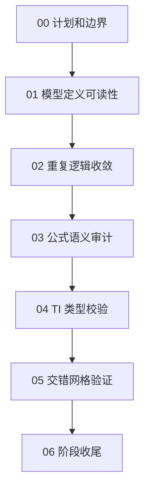

# 06 - Model Closeout Summary

## Scope

本阶段聚焦 `ADFWI/model`，目标是让模型层定义更清晰、职责更稳定、公式风险更可验证，而不是继续拆分模块或扩展框架。

涉及文件：

- `ADFWI/model/base.py`
- `ADFWI/model/acoustic_model.py`
- `ADFWI/model/elastic_model.py`
- `ADFWI/model/parameters.py`
- `tests/test_model_parameters.py`
- `docs/version-plans/bv1.2-model/`

## Completed Chain

## Main Outcomes

1. 模型层职责边界已明确：
   - `base.py`：几何、backend、参数访问、bounds、通用检查；
   - `acoustic_model.py`：声学持久参数、经验更新、声学约束；
   - `elastic_model.py`：弹性持久参数、Thomsen 参数、派生弹性量；
   - `parameters.py`：Lame、Thomsen、刚度分量和交错网格公式。
2. 重复生命周期逻辑已收敛到 `AbstractModel`：
   - 参数注册；
   - bounds 初始化；
   - `requires_grad` 元数据；
   - water layer mask；
   - 有界参数裁剪。
3. 公式敏感区域已补充语义契约：
   - 输入输出 shape；
   - 单位；
   - `lamu = rho * vp**2 = lambda + 2mu`；
   - 刚度分量顺序；
   - 交错网格输出 shape。
4. `elastic_moduli_for_TI` 已从非法类型静默行为改为显式 `ValueError`。
5. `parameter_staggered_grid` 当前行为已通过测试锁定：
   - 当前 stencil 的数值行为；
   - 常量场保持；
   - 弹性模型 `forward()` 后传播器相关 shape。

## Validation Evidence

本阶段使用了轻量但针对性的验证：

- 小模型 acoustic/isotropic/anisotropic before/after 数值对比：`max_abs=0`。
- `tests/test_model_parameters.py`：
  - TI VTI/HTI 合法布局稳定；
  - 非法 TI 类型报错；
  - 交错网格当前 stencil；
  - 常量场保持；
  - 弹性模型 `forward()` 后交错量 shape。
- `tests/test_backend_integration.py` 多次通过，22 tests OK。
- `py_compile ADFWI/model/*.py` 多次通过。
- `git diff --check` 多次通过。

## Current Stop Decision

`ADFWI/model` 这一阶段可以收尾。继续做泛泛审计会进入低收益循环。

当前不建议继续做：

- 为了“更整洁”继续拆分 `model` 文件；
- 重命名公开函数；
- 改 `parameter_staggered_grid` stencil；
- 把传播器 padding 逻辑并入 model；
- 迁移 examples 调用方式。

## Remaining Explicit Questions

这些不是当前阶段必须解决的问题，只有在后续出现明确需求时再开单独优化轮：

1. `parameter_staggered_grid` 的五点 stencil 是否是最优物理离散？
   - 需要单独公式研究和弹性正演数值对比。
2. `elastic_moduli_for_TI` 的 HTI 旋转约定是否需要和文献/传播器注释进一步对齐？
   - 需要 paper-to-code 级别检查。
3. 是否要为模型层增加更完整的 public API 文档？
   - 属于文档任务，不应混入公式或结构改动。

## Next Direction

建议暂停 `ADFWI/model` 内部优化，进入以下两个方向之一：

1. 使用 validation example 做一次模型层变更后的端到端 smoke 验证。
2. 转向下一个模块，例如 `ADFWI/survey` 或 `ADFWI/propagator`，但必须重新定义边界、验证方式和停止条件。
