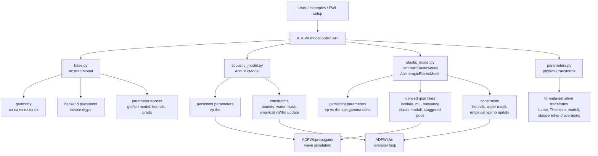

# Model Optimization Map

This map shows the intended ownership boundaries for `ADFWI/model`.

## Layer Map



## Responsibility Table

| File | Should Own | Should Not Own |
| --- | --- | --- |
| `base.py` | common geometry, backend placement, parameter access, bounds dictionaries, generic checks | acoustic/elastic physics formulas |
| `acoustic_model.py` | acoustic persistent parameters, empirical density/velocity update, acoustic constraints | wave propagation or FWI loss logic |
| `elastic_model.py` | elastic persistent parameters, anisotropic parameters, derived elastic quantities, elastic constraints | generic model helpers that can live in `base.py` |
| `parameters.py` | physical transform formulas and staggered-grid preparation | model object lifecycle or plotting |

## Parameter Lifecycle

```mermaid
flowchart LR
    Input[numpy/tensor input\nshape nz,nx]
    Input --> Validate[shape and bound checks]
    Validate --> Tensor[to backend tensor\ndevice dtype]
    Tensor --> Parameter[torch.nn.Parameter\nrequires_grad flag]
    Parameter --> Forward[model.forward()]
    Forward --> Empirical[optional empirical update]
    Forward --> Clamp[bounds + water mask]
    Clamp --> Derived[derived quantities\nelastic only]
    Derived --> Propagator[propagator inputs]
```

For acoustic models, `forward()` mainly applies optional empirical updates and
constraints. For elastic models, `forward()` also refreshes Lame parameters,
elastic moduli, and staggered-grid quantities.

## Risk Map

| Area | Risk | Validation Needed |
| --- | --- | --- |
| docstrings/imports/comments | low | compile/import checks |
| helper extraction with same tensor values | medium | small-model before/after comparison |
| bounds or water-layer mask behavior | medium | explicit mask/clamp tests |
| empirical `rho` or `vp` update | medium-high | saved value comparison |
| Thomsen/Lame/moduli/staggered formulas | high | numerical precision tests |
| propagator-facing output shapes | high | small forward simulation or existing propagator smoke |

## Preferred First Optimization

Start by clarifying names, comments, docstrings, and ownership without changing
formula outputs. That gives a stable reading path before any helper extraction
or numerical cleanup.
