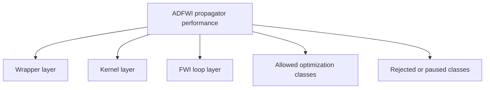
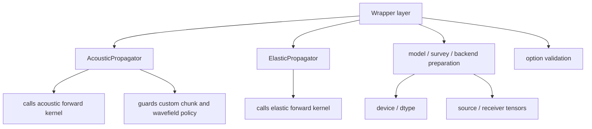
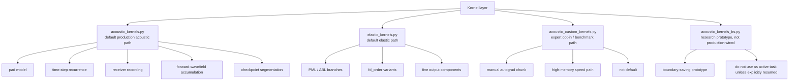
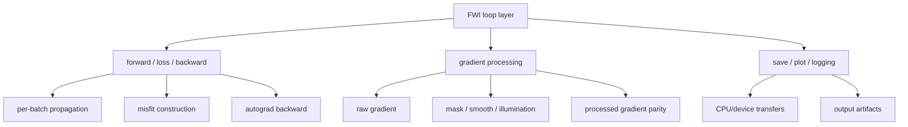
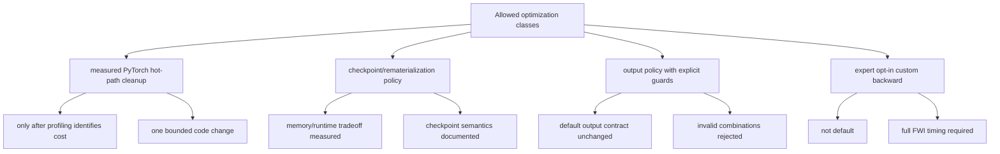
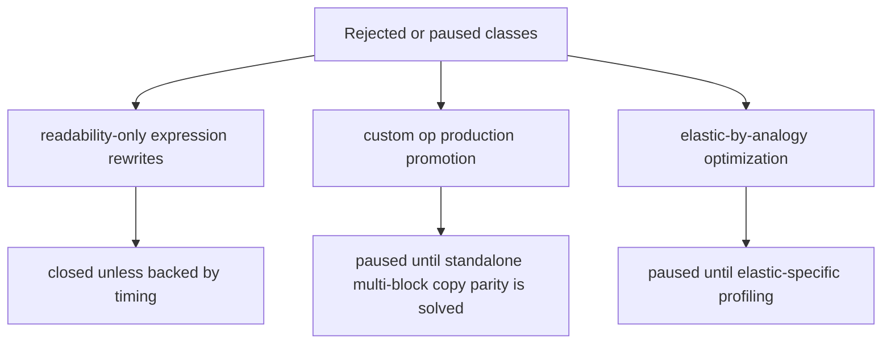

# Propagator Performance Plan

Date: 2026-06-02

This is the only active plan for `bv1.2-propagator-performance`. Historical
round logs and raw JSON outputs stay under `archive/` for traceability only.
Do not use archived files as the next optimization queue.

## Goal

Improve propagator efficiency without changing the scientific contract:

- forward waveform parity;
- loss parity;
- raw model-gradient parity;
- no silent output-contract change;
- no production promotion of experimental kernels without real FWI timing.

Current work is focused on the acoustic production path. Elastic optimization
is paused until acoustic performance work reaches a stable decision.

## Baseline

Reference case:

```text
examples/validation/marmousi2_acoustic_full_record
device: npu:0
dtype: float32
checkpoint_segments: 1
full inversion anchor: 300 iterations
```

Stable baseline:

```text
docs/version-plans/bv1.2/full-record-marmousi2-baseline.md
```

## Top-To-Bottom Map

### Overview



### Wrapper Layer



Optimization rule: wrappers may clarify contracts or remove repeated setup, but
must not hide numerical behavior changes.

### Kernel Layer



Optimization rule: kernel edits require waveform, loss, and raw-gradient parity.

### FWI Loop Layer



Optimization rule: FWI-loop changes must report seconds per iteration and loss
trajectory, not only single-forward timing.

### Allowed Optimization Classes



Optimization rule: a valid task must define the expected performance mechanism
before implementation.

### Rejected Or Paused Classes



Optimization rule: do not restart these lines from archive notes unless a new
measurement changes the premise.

## Current Decisions

Accepted default production changes:

- `checkpoint_segments == 1` checkpoint bypass;
- acoustic source-index hoist.
- skip detached illumination summaries during checkpoint backward replay.
- AcousticFWI `pressure_only="auto"` default for pressure-loss inversion loops.
- lazy zero placeholders for unused acoustic pressure-only `u/w` outputs.

Accepted opt-in paths:

- `save_forward_wavefield=False`, only when forward illumination is not used;
- `use_custom_chunk_backward=True`, expert high-memory speed path. It is a
  speed-ceiling reference, not the current optimization main line.
- `pressure_only=True`, acoustic FWI pressure-loss path that skips unused `u/w`
  receiver outputs and `u/w` forward-wavefield summaries. It remains opt-in at
  the `AcousticPropagator.forward` API level, while AcousticFWI uses it
  automatically.

Not promoted:

- receiver stack rewrite;
- pressure expression rewrites;
- `torch.compile` on the current NPU environment;
- `TorchGradProcessor` as default;
- rematerialized custom checkpoint path;
- Ascend custom-op production path;
- no-checkpoint direct return path.
- non-reentrant PyTorch checkpoint on the current NPU TorchScript path.
- checkpoint replay skip of detached forward-wavefield summaries through a
  `step_forward` signature/branch change.

## Current Progress

The performance branch has passed the broad exploration phase.

What is stable:

- acoustic full-record validation is available as the baseline;
- the active document set has been reduced to plan, test matrix, and change log;
- checkpoint replay and AcousticFWI pressure-policy changes are accepted;
- opt-in experimental paths are guarded and documented;
- AcousticFWI auto pressure policy is the current FWI default;
- failed or high-risk routes are explicitly closed or paused.

What is not stable enough for promotion:

- custom autograd is useful only as an expert high-memory path: reduced
  5-iteration FWI shows exact loss/update parity and `1.5367x` total speedup,
  but peak allocation rises from `272.5190 MiB` to `7882.8569 MiB`;
- saved-state divergence compression improves the memory/speed tradeoff but is
  still high-memory: best point saves only `div_p`, giving `1.3191x` total
  speedup with `5643.8008 MiB` peak allocation;
- rematerialized custom checkpoint controls memory but is still too slow:
  forward-saved boundary caching gives exact loss/update parity and lowers peak
  allocation to `527.9731 MiB`; every-step divergence caching improves total
  speedup to `1.1989x`; pressure-only receiver recording improves the current
  remat gate to `1.2773x`; skipping velocity receiver chunk copies lowers the
  candidate absolute time from `111.2747 s` to `106.6786 s`, but same-run speedup
  is `1.2332x` because the production reference run was also faster;
- Ascend custom op is blocked by standalone multi-block copy parity;
- non-reentrant PyTorch checkpoint failed during NPU TorchScript backward
  recompute;
- checkpoint replay wavefield-skip reduced checkpoint=10 backward only
  slightly but regressed checkpoint=1 timing;
- output/placeholder cleanup is exhausted: lazy zero placeholders were accepted,
  but omitting pressure-only velocity keys from the internal FWI record regressed
  steady-state total iteration from `25.9895 s` to `26.5913 s`;
- the current pressure-only backward operator profile shows that remaining cost
  is still dominated by autograd bookkeeping around `copy_`, `slice`,
  `slice_backward`, `empty_tensor`, zero allocation, and checkpoint replay;
- elastic optimization has not been profiled independently.

## Next Active Route

The next optimization should be:

```text
Acoustic pressure-only recurrence hot path.
```

Detailed design:

```text
docs/version-plans/bv1.2-propagator-performance/acoustic-adjoint-optimization-design.md
```

Target scope:

- acoustic only;
- pressure-loss FWI only;
- keep the current production path unchanged;
- use the production `AcousticFWI pressure_only="auto"` checkpoint path as the
  primary baseline;
- no elastic changes;
- no finite-difference equation changes;
- no `AcousticPropagator.forward` default output-contract change.

Current reduced checkpoint=10 baseline:

| Metric | Baseline |
| --- | ---: |
| final loss, 10 iterations | `4776.7587890625` |
| total seconds / iteration, excluding first | `25.9895 s` |
| forward seconds / iteration, excluding first | `3.8509 s` |
| backward seconds / iteration, excluding first | `21.4941 s` |

The next task should not replace production code. It should build one bounded
pressure-only recurrence prototype that reduces autograd slice-assignment graph
cost, then compare it against the production pressure-only checkpoint path.
Do not continue receiver-output, placeholder, source-shape, or Python
rematerialization micro-optimizations unless a new profile shows they are
dominant.

Current pressure-only operator-profile gate:

| Item | Result |
| --- | ---: |
| command shape | `shots=1`, `receivers=24`, `nx=100`, `nz=50`, `nt=400` |
| checkpoint policy | `checkpoint_segments=10`, `pressure_only=True` |
| forward time | `0.4680 s` |
| backward time | `21.6333 s` |
| top operators | `copy_`, `slice`, `CheckpointFunctionBackward`, `slice_backward`, `empty_tensor`, `InplaceCopy`, `SliceBackward0`, `zero_`, `zeros` |
| result file | `acoustic_pressure_only_backward_operator_profile_20260602.json` |

Current custom chunk result:

| Metric | Production full-output path | Current custom chunk |
| --- | ---: | ---: |
| loss trajectory | exact match | exact match |
| `vp_update_norm` | `4970.22314453125` | `4970.22314453125` |
| mean seconds / iteration | `27.9942 s` | `18.2167 s` |
| backward speedup | baseline | `1.9362x` |
| total speedup | baseline | `1.5367x` |
| peak allocated memory | `272.5190 MiB` | `7882.8569 MiB` |

This remains the speed ceiling reference, not the active production route.

Current rematerialized pressure-only candidate:

| Metric | Production full-output path | Rematerialized custom path |
| --- | ---: | ---: |
| loss trajectory | exact match | exact match |
| `vp_update_norm` | `4970.22314453125` | `4970.22314453125` |
| mean seconds / iteration | `26.3105 s` | `21.3357 s` |
| backward speedup | baseline | `1.3994x` |
| total speedup | baseline | `1.2332x` |
| peak allocated memory | `272.5190 MiB` | `528.1079 MiB` |

This is accepted only as an experimental path. Do not spend another round on
Python-level remat branch cleanup without a lower-level fusion plan; small
receiver-output cleanup alone is not enough to close the gap to the saved-state
speed ceiling.

Saved-state custom chunk conclusion:

| Candidate | Total speedup | Backward speedup | Peak memory | Decision |
| --- | ---: | ---: | ---: | --- |
| save no divergence | `1.2730x` | `1.4730x` | `4524.6577 MiB` | lower memory, slower |
| save only `div_p` | `1.3191x` | `1.5719x` | `5643.8008 MiB` | best current saved-state compression point |
| save only `div_u/div_w` | `1.2912x` | `1.5279x` | `6799.7402 MiB` | worse speed/memory tradeoff |
| save all divergence | `1.5367x` | `1.9362x` | `7882.8569 MiB` | speed ceiling, too much memory |

This confirms that divergence-state compression helps, but it does not solve
the memory problem. Do not continue saved-state divergence sweeps. Keep this
line as a speed-ceiling reference only.

Current main line:

```text
checkpoint-compatible rematerialized custom backward
```

Reason:

- it keeps memory close to PyTorch checkpoint behavior;
- it preserves exact reduced-FWI loss and update parity;
- its current speedup is modest (`1.1989x`), so remaining work must reduce
  replay/output cost without storing full per-step wavefield states.

## Comparison Scheme For Next Task

Before/after comparison must use the same:

- branch;
- device and dtype;
- model shape;
- shot count;
- receiver count;
- `checkpoint_segments`;
- `save_forward_wavefield` setting;
- loss definition.

Minimum baseline command:

```bash
conda run -n adfwi python scripts/benchmark/acoustic_fwi_iteration_profile.py \
  --validation-case reduced \
  --device npu:0 \
  --dtype float32 \
  --iterations 10 \
  --checkpoint-segments 10
```

Required record:

- forward waveform max absolute and relative difference;
- pressure-loss difference;
- raw `vp.grad` max absolute and relative difference;
- forward/backward/total timing or seconds per iteration;
- decision: continue this line or stop.

## Next Optimization Rule

Each future task must state:

1. the exact file and hot path;
2. the expected performance mechanism;
3. the before/after test command;
4. waveform/loss/gradient parity result;
5. seconds-per-iteration or forward/backward timing result;
6. whether the line continues or stops.

If a task cannot satisfy those six fields, it is not a valid performance task.
