# Propagator Performance Plan

Date: 2026-06-02

This is the only active plan for `bv1.2-propagator-performance`. Historical
round logs and raw JSON outputs stay under `archive/` for traceability only.
Do not use archived files as the next optimization queue.

## Goal

Improve propagator efficiency without changing the scientific contract:

- forward waveform parity;
- loss parity;
- raw model-gradient parity;
- no silent output-contract change;
- no production promotion of experimental kernels without real FWI timing.

Current work is focused on the acoustic production path. Elastic optimization
is paused until acoustic performance work reaches a stable decision.

## Baseline

Reference case:

```text
examples/validation/marmousi2_acoustic_full_record
device: npu:0
dtype: float32
checkpoint_segments: 1
full inversion anchor: 300 iterations
```

Stable baseline:

```text
docs/version-plans/bv1.2/full-record-marmousi2-baseline.md
```

## Top-To-Bottom Map

```mermaid
flowchart TD
    A["ADFWI propagator performance"]

    A --> B["Wrapper layer"]
    B --> B1["AcousticPropagator / ElasticPropagator"]
    B --> B2["prepare model, survey, backend"]

    A --> C["Kernel layer"]
    C --> C1["acoustic_kernels.py<br/>default production acoustic path"]
    C --> C2["elastic_kernels.py<br/>default elastic path"]
    C --> C3["acoustic_custom_kernels.py<br/>expert opt-in / benchmark path"]
    C --> C4["acoustic_kernels_bs.py<br/>research prototype, not production-wired"]

    A --> D["FWI loop layer"]
    D --> D1["forward / loss / backward"]
    D --> D2["gradient processing"]
    D --> D3["save / plot / logging"]

    A --> E["Allowed optimization classes"]
    E --> E1["measured PyTorch hot-path cleanup"]
    E --> E2["checkpoint/rematerialization policy"]
    E --> E3["output policy with explicit guards"]
    E --> E4["expert opt-in custom backward"]

    A --> F["Rejected or paused classes"]
    F --> F1["readability-only expression rewrites"]
    F --> F2["custom op production promotion"]
    F --> F3["elastic-by-analogy optimization"]
```



## Current Decisions

Accepted default production changes:

- `checkpoint_segments == 1` checkpoint bypass;
- acoustic source-index hoist.

Accepted opt-in paths:

- `save_forward_wavefield=False`, only when forward illumination is not used;
- `use_custom_chunk_backward=True`, expert high-memory speed path.

Not promoted:

- receiver stack rewrite;
- pressure expression rewrites;
- `torch.compile` on the current NPU environment;
- `TorchGradProcessor` as default;
- rematerialized custom checkpoint path;
- Ascend custom-op production path;
- no-checkpoint direct return path.

## Next Optimization Rule

Each future task must state:

1. the exact file and hot path;
2. the expected performance mechanism;
3. the before/after test command;
4. waveform/loss/gradient parity result;
5. seconds-per-iteration or forward/backward timing result;
6. whether the line continues or stops.

If a task cannot satisfy those six fields, it is not a valid performance task.
