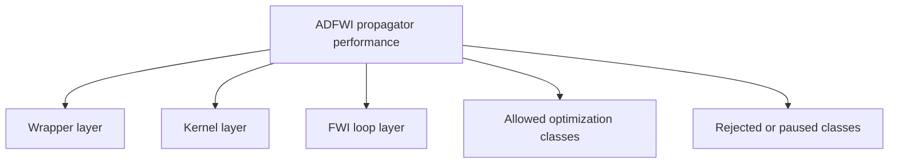
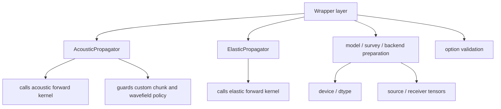
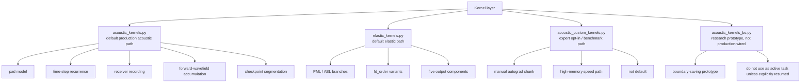
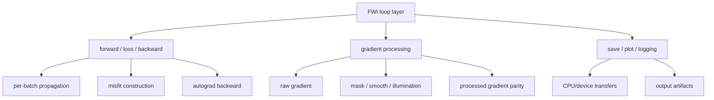
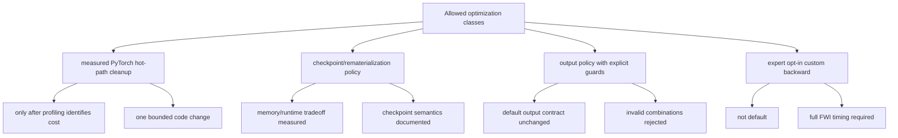
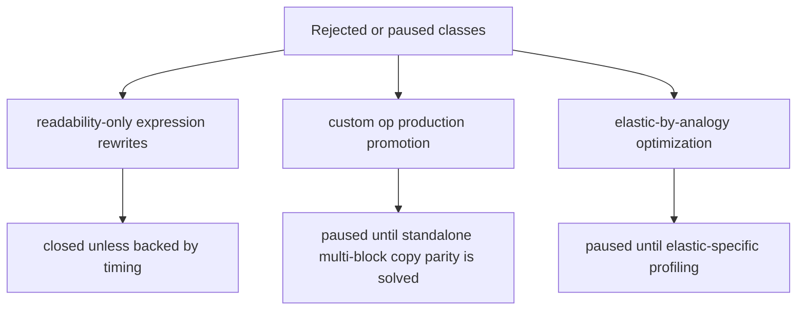

# Propagator Performance Plan

Date: 2026-06-02

This is the only active plan for `bv1.2-propagator-performance`. Historical
round logs and raw JSON outputs stay under `archive/` for traceability only.
Do not use archived files as the next optimization queue.

## Goal

Improve propagator efficiency without changing the scientific contract:

- forward waveform parity;
- loss parity;
- raw model-gradient parity;
- no silent output-contract change;
- no production promotion of experimental kernels without real FWI timing.

Current work is focused on the acoustic production path. Elastic optimization
is paused until acoustic performance work reaches a stable decision.

## Baseline

Reference case:

```text
examples/validation/marmousi2_acoustic_full_record
device: npu:0
dtype: float32
checkpoint_segments: 1
full inversion anchor: 300 iterations
```

Stable baseline:

```text
docs/version-plans/bv1.2/full-record-marmousi2-baseline.md
```

## Top-To-Bottom Map

### Overview



### Wrapper Layer



Optimization rule: wrappers may clarify contracts or remove repeated setup, but
must not hide numerical behavior changes.

### Kernel Layer



Optimization rule: kernel edits require waveform, loss, and raw-gradient parity.

### FWI Loop Layer



Optimization rule: FWI-loop changes must report seconds per iteration and loss
trajectory, not only single-forward timing.

### Allowed Optimization Classes



Optimization rule: a valid task must define the expected performance mechanism
before implementation.

### Rejected Or Paused Classes



Optimization rule: do not restart these lines from archive notes unless a new
measurement changes the premise.

## Current Decisions

Accepted default production changes:

- `checkpoint_segments == 1` checkpoint bypass;
- acoustic source-index hoist.
- skip detached illumination summaries during checkpoint backward replay.
- AcousticFWI `pressure_only="auto"` default for pressure-loss inversion loops.
- lazy zero placeholders for unused acoustic pressure-only `u/w` outputs.

Accepted opt-in paths:

- `save_forward_wavefield=False`, only when forward illumination is not used;
- `use_custom_chunk_backward=True`, expert high-memory speed path. It is a
  speed-ceiling reference, not the current optimization main line.
- `pressure_only=True`, acoustic FWI pressure-loss path that skips unused `u/w`
  receiver outputs and `u/w` forward-wavefield summaries. It remains opt-in at
  the `AcousticPropagator.forward` API level, while AcousticFWI uses it
  automatically.

Not promoted:

- receiver stack rewrite;
- pressure expression rewrites;
- `torch.compile` on the current NPU environment;
- `TorchGradProcessor` as default;
- rematerialized custom checkpoint path;
- Ascend custom-op production path;
- no-checkpoint direct return path.
- non-reentrant PyTorch checkpoint on the current NPU TorchScript path.
- checkpoint replay skip of detached forward-wavefield summaries through a
  `step_forward` signature/branch change.

## Current Progress

The performance branch has passed the broad exploration phase.

What is stable:

- acoustic full-record validation is available as the baseline;
- the active document set has been reduced to plan, test matrix, and change log;
- checkpoint replay and AcousticFWI pressure-policy changes are accepted;
- opt-in experimental paths are guarded and documented;
- AcousticFWI auto pressure policy is the current FWI default;
- failed or high-risk routes are explicitly closed or paused.

What is not stable enough for promotion:

- custom autograd is useful only as an expert high-memory path: reduced
  5-iteration FWI shows exact loss/update parity and `1.5367x` total speedup,
  but peak allocation rises from `272.5190 MiB` to `7882.8569 MiB`;
- saved-state divergence compression improves the memory/speed tradeoff but is
  still high-memory: best point saves only `div_p`, giving `1.3191x` total
  speedup with `5643.8008 MiB` peak allocation;
- rematerialized custom checkpoint controls memory but is still too slow:
  forward-saved boundary caching gives exact loss/update parity and lowers peak
  allocation to `527.9731 MiB`; every-step divergence caching improves total
  speedup to `1.1989x`; pressure-only receiver recording improves the current
  remat gate to `1.2773x`; skipping velocity receiver chunk copies lowers the
  candidate absolute time from `111.2747 s` to `106.6786 s`, but same-run speedup
  is `1.2332x` because the production reference run was also faster;
- Ascend custom op is blocked by standalone multi-block copy parity;
- non-reentrant PyTorch checkpoint failed during NPU TorchScript backward
  recompute;
- checkpoint replay wavefield-skip reduced checkpoint=10 backward only
  slightly but regressed checkpoint=1 timing;
- output/placeholder cleanup is exhausted: lazy zero placeholders were accepted,
  but omitting pressure-only velocity keys from the internal FWI record regressed
  steady-state total iteration from `25.9895 s` to `26.5913 s`;
- the current pressure-only backward operator profile shows that remaining cost
  is still dominated by autograd bookkeeping around `copy_`, `slice`,
  `slice_backward`, `empty_tensor`, zero allocation, and checkpoint replay;
- elastic optimization has not been profiled independently.

## Next Active Route

The next optimization should be:

```text
Acoustic pressure-only recurrence hot path.
```

Detailed design:

```text
docs/version-plans/bv1.2-propagator-performance/acoustic-adjoint-optimization-design.md
```

Target scope:

- acoustic only;
- pressure-loss FWI only;
- keep the current production path unchanged;
- use the production `AcousticFWI pressure_only="auto"` checkpoint path as the
  primary baseline;
- no elastic changes;
- no finite-difference equation changes;
- no `AcousticPropagator.forward` default output-contract change.

Current reduced checkpoint=10 baseline:

| Metric | Baseline |
| --- | ---: |
| final loss, 10 iterations | `4776.7587890625` |
| total seconds / iteration, excluding first | `25.9895 s` |
| forward seconds / iteration, excluding first | `3.8509 s` |
| backward seconds / iteration, excluding first | `21.4941 s` |

The next task should not replace production code. It should build one bounded
pressure-only recurrence prototype that reduces autograd slice-assignment graph
cost, then compare it against the production pressure-only checkpoint path.
Do not continue receiver-output, placeholder, source-shape, or Python
rematerialization micro-optimizations unless a new profile shows they are
dominant.

Current pressure-only operator-profile gate:

| Item | Result |
| --- | ---: |
| command shape | `shots=1`, `receivers=24`, `nx=100`, `nz=50`, `nt=400` |
| checkpoint policy | `checkpoint_segments=10`, `pressure_only=True` |
| forward time | `0.4680 s` |
| backward time | `21.6333 s` |
| top operators | `copy_`, `slice`, `CheckpointFunctionBackward`, `slice_backward`, `empty_tensor`, `InplaceCopy`, `SliceBackward0`, `zero_`, `zeros` |
| result file | `acoustic_pressure_only_backward_operator_profile_20260602.json` |

Current bounded prototype gate:

| Item | Result |
| --- | ---: |
| prototype | pressure inner-state recurrence |
| reference | full pressure field with sliced assignment |
| candidate | pressure interior as recurrent state |
| output/loss/gradient max abs diff | `0.0` |
| mean forward speedup | `1.1977x` |
| mean backward speedup | `1.1645x` |
| mean total speedup | `1.1714x` |
| result file | `acoustic_pressure_inner_state_microbenchmark_20260602.json` |

This prototype validates the mechanism but not the full production recurrence.
The next task is to test whether the same state-reduction idea can handle the
coupled acoustic `p/u/w` recurrence, receiver sampling, and source injection in
a benchmark-only implementation. Production `acoustic_kernels.py` should remain
unchanged until that coupled prototype passes output/loss/raw-gradient parity.

Current coupled custom-backward gate:

| Item | Result |
| --- | ---: |
| prototype | coupled `p/u/w` custom backward |
| enabled features | source injection, free-surface write, receiver recording |
| loss components | `p,rcv_p` |
| output/loss max abs diff | `0.0` |
| max gradient abs diff | `1.1920928955078125e-07` |
| max gradient rel diff | `4.812639090232551e-04` |
| mean forward speedup | `0.8779x` |
| mean backward speedup | `1.9633x` |
| mean total speedup | `1.5144x` |
| result file | `acoustic_custom_multistep_pressure_loss_probe_repeat_20260603.json` |

Longer-step coupled gate:

| Item | Result |
| --- | ---: |
| recurrence steps | `80` |
| enabled features | source injection, free-surface write, receiver recording |
| loss components | `p,rcv_p` |
| output/loss max abs diff | `0.0` |
| max gradient abs diff | `4.76837158203125e-07` |
| max gradient rel diff | `7.764155452605337e-05` |
| mean forward speedup | `0.8916x` |
| mean backward speedup | `2.0144x` |
| mean total speedup | `1.5444x` |
| result file | `acoustic_custom_multistep_pressure_loss_steps80_20260603.json` |

This is now the main high-value route. The next task should stop extending toy
recurrence length and instead build a production-chunk gate: same model/survey
input preparation as `AcousticPropagator`, pressure receiver output and
pressure-loss comparison, and raw `vp.grad` parity against the production
pressure-only checkpoint path. Do not make `acoustic_kernels.py` call this path
until the production-chunk gate passes.

Current production-interface gate status:

| Gate | Result | Decision |
| --- | --- | --- |
| observed-pressure, `nt=120` | output/loss diff `0.0`, but production and candidate raw `vp.grad` are non-finite | invalid acceptance gate |
| observed-pressure, `nt=240` | output/loss diff `0.0`, but production and candidate raw `vp.grad` are non-finite | invalid acceptance gate |
| synthetic-energy, `nt=120` | output/loss diff `0.0`, raw `vp.grad` max abs diff `7.11e-15`, backward speedup `1.9353x`, total speedup `1.4474x` | useful finite-gradient production-interface evidence |
| observed-pressure reduced shape, `nt=3000` | output/loss diff `0.0`, raw `vp.grad` max abs diff `2.80e-7`, backward speedup `1.8051x`, total speedup `1.3829x`, memory ratio `55.08x` | finite pressure-loss speed gate passed, memory not acceptable |

The next task is memory reduction for the finite observed-pressure
production-chunk path. Do not continue speed-only gates until peak memory is
reduced substantially while keeping pressure receiver output, pressure loss,
and raw `vp.grad` within the established NPU float32 tolerance band.

Current custom chunk result:

| Metric | Production full-output path | Current custom chunk |
| --- | ---: | ---: |
| loss trajectory | exact match | exact match |
| `vp_update_norm` | `4970.22314453125` | `4970.22314453125` |
| mean seconds / iteration | `27.9942 s` | `18.2167 s` |
| backward speedup | baseline | `1.9362x` |
| total speedup | baseline | `1.5367x` |
| peak allocated memory | `272.5190 MiB` | `7882.8569 MiB` |

This remains the speed ceiling reference, not the active production route.

Current rematerialized pressure-only candidate:

| Metric | Production full-output path | Rematerialized custom path |
| --- | ---: | ---: |
| loss trajectory | exact match | exact match |
| `vp_update_norm` | `4970.22314453125` | `4970.22314453125` |
| mean seconds / iteration | `26.3105 s` | `21.3357 s` |
| backward speedup | baseline | `1.3994x` |
| total speedup | baseline | `1.2332x` |
| peak allocated memory | `272.5190 MiB` | `528.1079 MiB` |

This is accepted only as an experimental path. Do not spend another round on
Python-level remat branch cleanup without a lower-level fusion plan; small
receiver-output cleanup alone is not enough to close the gap to the saved-state
speed ceiling.

Saved-state custom chunk conclusion:

| Candidate | Total speedup | Backward speedup | Peak memory | Decision |
| --- | ---: | ---: | ---: | --- |
| save no divergence | `1.2730x` | `1.4730x` | `4524.6577 MiB` | lower memory, slower |
| save only `div_p` | `1.3191x` | `1.5719x` | `5643.8008 MiB` | best current saved-state compression point |
| save only `div_u/div_w` | `1.2912x` | `1.5279x` | `6799.7402 MiB` | worse speed/memory tradeoff |
| save all divergence | `1.5367x` | `1.9362x` | `7882.8569 MiB` | speed ceiling, too much memory |

This confirms that divergence-state compression helps, but it does not solve
the memory problem. Do not continue saved-state divergence sweeps. Keep this
line as a speed-ceiling reference only.

Current hard constraint:

```text
peak memory <= 2.5x production checkpoint_segments=10 baseline
```

Reason:

- checkpointing is used primarily to control memory, so speedups that exceed a
  bounded memory envelope are not valid main-line optimizations;
- it preserves exact reduced-FWI loss and update parity;
- the measured production `checkpoint_segments=1` upper-bound gate gives only
  `1.2087x` total speedup over checkpoint=10 while using `7.4425x` memory, so
  it fails the new memory constraint;
- the saved-state custom chunk is faster (`1.3435x` total speedup on the same
  one-iteration gate), but its `27.1292x` memory cost also fails the memory
  constraint;
- remaining work must reduce replay/output cost without storing full per-step
  wavefield states, and any candidate should be judged against production
  checkpoint=10 for both timing and peak memory.

Next bounded target:

```text
improve total iteration time while keeping peak memory <= 2.5x production
checkpoint_segments=10 and preserving receiver output, loss, and raw vp.grad.
```

This makes the current rematerialized pressure-only path the only active
candidate class close to the memory boundary: it was measured at about `1.94x`
peak memory with `1.2332x` total speedup on the reduced 5-iteration gate. The
next task should optimize that line, not the high-memory saved-state chunk.

The latest observed-pressure one-iteration cache-policy gate refines that
target:

| Candidate | Total speedup | Peak memory ratio | Decision |
| --- | ---: | ---: | --- |
| remat pressure, cache `p,u,w` divergence | `1.2049x` | `2.7631x` | too much memory |
| remat pressure, no divergence cache | `1.0390x` | `1.7192x` | valid but weak |
| remat pressure, cache `div_p` only | `1.0654x` | `2.0635x` | current budget-valid baseline |
| remat pressure, cache `div_p` only, scripted forward | `1.1752x` | `2.0635x` | current budget-valid baseline |
| remat pressure, cache `p,u,w` divergence every 2 steps | `1.2352x` | `2.2436x` | current best budget-valid one-iteration point |
| remat pressure, cache `p,u,w` divergence every 3 steps | `1.1720x` | `2.0688x` | valid but slower than stride=2 |

The scripted pressure-only remat forward removed the largest candidate forward
overhead without increasing memory. The latest cache-policy test shows that
complete divergence caching every 2 steps is a better memory-budget candidate
than `div_p`-only caching: it keeps peak memory below `2.5x` and improves
one-iteration speedup from `1.1752x` to `1.2352x`.

The short reduced-FWI loop gate also passed for this stride=2 policy:

| Metric | Production ckpt10 | Remat `p,u,w` stride=2 |
| --- | ---: | ---: |
| 5-iteration loss trajectory | exact reference | exact match |
| `vp_update_norm` | `4970.22314453125` | `4970.22314453125` |
| mean seconds / iteration | `27.7475 s` | `22.9651 s` |
| total speedup | baseline | `1.2082x` |
| peak memory | `272.5190 MiB` | `616.2178 MiB` |
| peak memory ratio | baseline | `2.2612x` |

This is now the active budget-valid remat candidate. Next code-level
optimization should start from this stride=2 configuration and target backward
replay/reverse-loop cost while keeping peak memory below `2.5x` production
checkpoint=10.

The stride=2 candidate is now available through the production wrapper as an
expert opt-in strategy:

```python
propagator.forward(
    checkpoint_segments=10,
    save_forward_wavefield=False,
    pressure_only=True,
    custom_chunk_strategy="remat_pressure_stride2",
)
```

This is not the default production path. The wrapper gate preserves the same
numerical contract as the experimental helper: one-iteration loss diff `0.0`,
raw `vp.grad` max abs diff `2.7381e-07`, memory ratio `2.2436x`, and total
speedup `1.2339x`. The 5-iteration reduced FWI wrapper gate matched the full
loss trajectory and `vp_update_norm`, with mean iteration time improving from
`27.3676 s` to `22.8406 s` and memory ratio `2.2612x`.

A longer 10-iteration full-record-geometry wrapper gate also passed with
`shots=3`, `receivers=200`, `nt=3000`, `nx=200`, and `nz=88`: max loss abs
diff `4.8828125e-04`, exact `vp_update_norm`, mean iteration time
`28.2326 s -> 23.7453 s`, total speedup `1.1890x`, and memory ratio `2.2612x`.

The 10-iteration full 40-shot full-batch wrapper gate also preserved the model
update, but it exceeded the memory budget: max loss abs diff `0.00390625`,
exact `vp_update_norm`, mean iteration time `27.2223 s -> 22.1970 s`, total
speedup `1.2264x`, and peak memory ratio `3.4826x`. This is useful as a
speed/numerical validation, but it is not an accepted memory-budget
configuration under the current `<=2.5x` rule. The next validation for full
40-shot use should reduce `batch_size` before changing kernel code again.

The follow-up 40-shot batch-size probes show that memory can be reduced without
changing the kernel:

| Batch size | Remat peak memory | Extra memory vs production | Mean iteration remat | Speedup vs matching production |
| ---: | ---: | ---: | ---: | ---: |
| `40` | `8169.3687 MiB` | `5823.6236 MiB` | `22.1970 s` | `1.2264x` |
| `20` | `4278.2402 MiB` | `2957.7300 MiB` | `42.7511 s` | `1.2274x` |
| `10` | `2229.2886 MiB` | `1413.7686 MiB` | `89.1110 s` | `1.2353x` |

This means the current accepted strategy should not be treated as a single
configuration. It is an expert opt-in strategy with a batch-size memory dial:
`batch_size=40` is speed-first, `batch_size=20` cuts the extra memory by about
half, and `batch_size=10` is memory-first but slow in absolute time.

The full 40-shot 1-iteration cache-policy probe shows that simple
divergence-cache tuning is not enough to solve the remaining memory issue.
The best-speed policy, `p,u,w` divergence stride=2, reached `1.2173x` speedup
with `8720.5942 MiB` peak memory. Increasing cache stride to `4` reduced peak
memory only to `7712.2754 MiB` and reduced speedup to `1.1401x`; no-divergence
cache reduced peak memory to `6670.0513 MiB` but speedup fell to `1.0838x`.
All variants preserved loss and raw `vp.grad` parity at the one-iteration gate.
The next useful memory investigation is therefore not another stride scan; it
should locate non-divergence peak contributors such as state cache, receiver
outputs/loss tensors, saved autograd tensors, and allocator peak behavior.

The phase-level 40-shot memory breakdown narrows the source further. Production
and remat have almost identical forward peaks (`~665 MiB`) and observed-loss
peaks (`~1282 MiB`). The full remat peak appears only during backward:
production backward peaks at `2290.0200 MiB`, while remat stride=2 peaks at
`8168.2461 MiB`, then both drop back to `461.0835 MiB` current allocation after
backward. Replacing observed-pressure loss with synthetic-energy loss still
peaks at `8166.6865 MiB`, so the receiver/loss graph is not the dominant
source. The next optimization/research boundary is now specific: inspect and
reduce temporary tensors inside the rematerialized custom backward replay, or
confirm that the excess is NPU allocator peak behavior.

Do not use full `torch.autograd.profiler` as the next step for this route.
Observed-pressure short gates can be numerically invalid, while finite
`nt=3000` and even tiny synthetic-energy profiler runs were too slow on the
current NPU/custom-autograd path. The next useful diagnostic is lightweight
stage timing inside the rematerialized backward replay or a formula-level
analysis of which recomputed terms can be reduced without storing full
per-step state.

The lightweight stage timing result is now available:

| Stage | Fraction of backward | Seconds |
| --- | ---: | ---: |
| replay states and divergence | `27.34%` | `5.3446 s` |
| initialize gradient buffers | `0.01%` | `0.0020 s` |
| reverse adjoint loop | `72.36%` | `14.1475 s` |

Therefore the next optimization should focus on the reverse adjoint loop:

- avoid or cheapen `p_new` reconstruction for `div_u/div_w`;
- reduce receiver adjoint scatter cost;
- reduce `_backward_step_from_saved_divergence` cost;
- keep the memory ratio below `2.5x`.

After switching the active candidate to `p,u,w` divergence cache stride=2, the
fine-grained reverse-loop diagnostic shows the current cost order:

| Reverse-loop sub-stage | Fraction of backward |
| --- | ---: |
| manual adjoint step | `53.96%` |
| divergence recovery | `11.05%` |
| receiver scatter | `4.30%` |
| coefficient accumulation | `1.63%` |

The next code-level optimization should therefore target
`_backward_step_from_saved_divergence` itself. Divergence recovery is now a
secondary target because stride=2 already reduced the recompute pressure.

Two direct manual-adjoint micro-edits were rejected after one-iteration gates:

- repeated-slice local view cleanup: numerically valid, but slower/no better
  than the active stride=2 candidate;
- pressure-gradient clone removal: numerically valid, but slower/no better than
  the active stride=2 candidate.

Do not continue local expression or single-clone rewrites in this function.
The next useful route must be a structural candidate, for example a stricter
pressure-only adjoint specialization or a fused manual-adjoint helper that
reduces kernel launches without changing per-step coefficient-gradient
semantics.

A direct in-place coefficient-gradient buffer accumulation test has been
rejected. It stayed within the speed/memory envelope, but changed raw
`vp.grad` by `9.5673e-02`. Do not optimize this loop by changing the order or
location of coefficient-gradient accumulation. Future reverse-loop work must
preserve the original per-step accumulation semantics exactly.

## Comparison Scheme For Next Task

Before/after comparison must use the same:

- branch;
- device and dtype;
- model shape;
- shot count;
- receiver count;
- `checkpoint_segments`;
- `save_forward_wavefield` setting;
- loss definition.

Minimum baseline command:

```bash
conda run -n adfwi python scripts/benchmark/acoustic_fwi_iteration_profile.py \
  --validation-case reduced \
  --device npu:0 \
  --dtype float32 \
  --iterations 10 \
  --checkpoint-segments 10
```

Required record:

- forward waveform max absolute and relative difference;
- pressure-loss difference;
- raw `vp.grad` max absolute and relative difference;
- forward/backward/total timing or seconds per iteration;
- decision: continue this line or stop.

## Next Optimization Rule

Each future task must state:

1. the exact file and hot path;
2. the expected performance mechanism;
3. the before/after test command;
4. waveform/loss/gradient parity result;
5. seconds-per-iteration or forward/backward timing result;
6. whether the line continues or stops.

If a task cannot satisfy those six fields, it is not a valid performance task.
