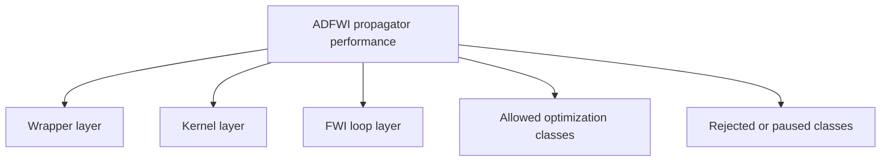
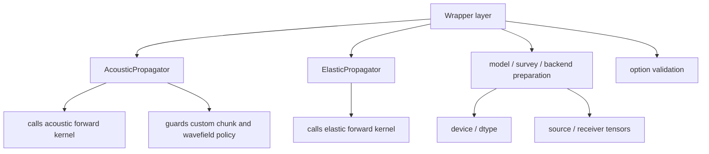
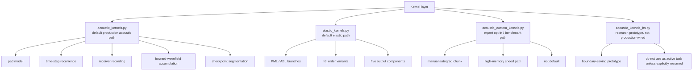
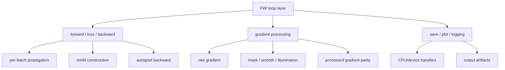
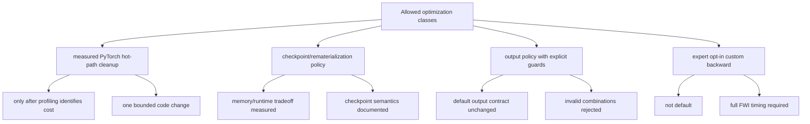
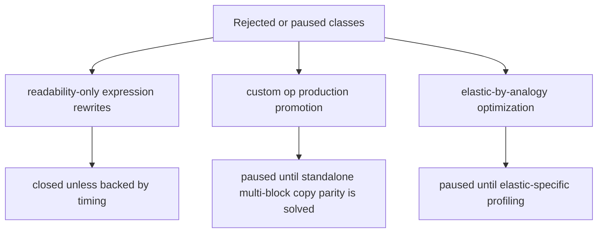

# Propagator Performance Plan

Date: 2026-06-02

This is the only active plan for `bv1.2-propagator-performance`. Historical
round logs and raw JSON outputs stay under `archive/` for traceability only.
Do not use archived files as the next optimization queue.

## Goal

Improve propagator efficiency without changing the scientific contract:

- forward waveform parity;
- loss parity;
- raw model-gradient parity;
- no silent output-contract change;
- no production promotion of experimental kernels without real FWI timing.

Current work is focused on the acoustic production path. Elastic optimization
is paused until acoustic performance work reaches a stable decision.

## Baseline

Reference case:

```text
examples/validation/marmousi2_acoustic_full_record
device: npu:0
dtype: float32
checkpoint_segments: 1
full inversion anchor: 300 iterations
```

Stable baseline:

```text
docs/version-plans/bv1.2/full-record-marmousi2-baseline.md
```

## Top-To-Bottom Map

### Overview



### Wrapper Layer



Optimization rule: wrappers may clarify contracts or remove repeated setup, but
must not hide numerical behavior changes.

### Kernel Layer



Optimization rule: kernel edits require waveform, loss, and raw-gradient parity.

### FWI Loop Layer



Optimization rule: FWI-loop changes must report seconds per iteration and loss
trajectory, not only single-forward timing.

### Allowed Optimization Classes



Optimization rule: a valid task must define the expected performance mechanism
before implementation.

### Rejected Or Paused Classes



Optimization rule: do not restart these lines from archive notes unless a new
measurement changes the premise.

## Current Decisions

Accepted default production changes:

- `checkpoint_segments == 1` checkpoint bypass;
- acoustic source-index hoist.

Accepted opt-in paths:

- `save_forward_wavefield=False`, only when forward illumination is not used;
- `use_custom_chunk_backward=True`, expert high-memory speed path.

Not promoted:

- receiver stack rewrite;
- pressure expression rewrites;
- `torch.compile` on the current NPU environment;
- `TorchGradProcessor` as default;
- rematerialized custom checkpoint path;
- Ascend custom-op production path;
- no-checkpoint direct return path.

## Current Progress

The performance branch has passed the broad exploration phase.

What is stable:

- acoustic full-record validation is available as the baseline;
- the active document set has been reduced to plan, test matrix, and change log;
- two small production changes are accepted;
- two opt-in paths are guarded and documented;
- failed or high-risk routes are explicitly closed or paused.

What is not stable enough for promotion:

- custom autograd is useful only as an expert high-memory path;
- rematerialized custom checkpoint did not provide a good memory/runtime result;
- Ascend custom op is blocked by standalone multi-block copy parity;
- elastic optimization has not been profiled independently.

## Next Active Route

The next optimization should be:

```text
Production acoustic PyTorch hot path, measured before implementation.
```

Target file:

```text
ADFWI/propagator/acoustic_kernels.py
```

Target scope:

- default acoustic path only;
- no custom autograd promotion;
- no elastic changes;
- no finite-difference equation changes;
- no output-contract change.

Primary candidates to measure:

| Candidate | Why it is still valid | Boundary |
| --- | --- | --- |
| receiver recording cost | happens every timestep and stores `p/u/w` | must keep exact receiver output ordering and shape |
| forward-wavefield accumulation cost | three reductions every timestep when enabled | only optimize default behavior, do not silently skip outputs |
| checkpoint segment overhead for `checkpoint_segments > 1` | production still uses PyTorch checkpoint for memory-saving mode | must preserve checkpoint memory semantics |
| repeated output allocation/copy across chunks | visible in `forward_kernel` chunk assembly | no direct-return change unless timing improves |

The next task should not directly edit code first. It should run a focused
profile comparison that separates:

```text
receiver recording
forward-wavefield accumulation
checkpoint segment assembly
backward/autograd cost
```

Then select exactly one code change from the measured dominant cost.

## Comparison Scheme For Next Task

Before/after comparison must use the same:

- branch;
- device and dtype;
- model shape;
- shot count;
- receiver count;
- `checkpoint_segments`;
- `save_forward_wavefield` setting;
- loss definition.

Minimum commands:

```bash
conda run -n adfwi python scripts/benchmark/acoustic_fwi_iteration_profile.py \
  --device npu:0 \
  --dtype float32 \
  --iterations 5 \
  --checkpoint-segments 1
```

and, if the selected target touches output recording or wavefield accumulation:

```bash
conda run -n adfwi python scripts/benchmark/acoustic_checkpoint_overhead.py \
  --device npu:0 \
  --dtype float32 \
  --warmup 0 \
  --repeat 2 \
  --checkpoint-segments 1 \
  --nx 100 \
  --nz 50 \
  --nabc 20 \
  --nt 800 \
  --dx 40 \
  --dz 40 \
  --dt 0.003 \
  --f0 5
```

Required record:

- forward waveform max absolute and relative difference;
- pressure-loss difference;
- raw `vp.grad` max absolute and relative difference;
- forward/backward/total timing or seconds per iteration;
- decision: continue this line or stop.

## Next Optimization Rule

Each future task must state:

1. the exact file and hot path;
2. the expected performance mechanism;
3. the before/after test command;
4. waveform/loss/gradient parity result;
5. seconds-per-iteration or forward/backward timing result;
6. whether the line continues or stops.

If a task cannot satisfy those six fields, it is not a valid performance task.
