# AD-FWI Efficiency Method Map

Date: 2026-05-31

This map summarizes realistic ways to improve automatic-differentiation FWI
performance in ADFWI. It is a method selection guide, not a task queue.

## Method Map

```mermaid
flowchart TD
    Goal[ADFWI performance]
    Goal --> Measure[Profile first]
    Measure --> AD[AD graph efficiency]
    Measure --> Kernel[Kernel execution]
    Measure --> Loop[FWI loop overhead]
    Measure --> Elastic[Elastic-specific profiling]
    Measure --> Research[Research-only methods]

    AD --> Checkpoint[checkpoint / rematerialization policy]
    AD --> GraphPrune[output graph pruning]
    AD --> GradParity[raw and processed gradient parity]

    Kernel --> Source[move invariant source and receiver setup]
    Kernel --> Sampling[receiver sampling cost]
    Kernel --> Wavefield[forward-wavefield accumulation cost]
    Kernel --> Allocation[allocation and tensor layout]

    Loop --> GradProcessor[gradient processing]
    Loop --> Transfer[CPU/device transfer]
    Loop --> IO[plot/save/log overhead]

    Elastic --> Branch[PML vs ABL]
    Elastic --> Order[fd_order 4/6/8/10]
    Elastic --> Components[five-component output cost]

    Research --> CustomAdjoint[custom autograd / adjoint-state]
    Research --> AMP[mixed precision]
    Research --> Compile[torch.compile / graph capture]
```

## Candidate Classes

| Class | ADFWI location | Default risk | When to use | Validation requirement |
| --- | --- | --- | --- | --- |
| checkpoint/rematerialization policy | `ADFWI/propagator/*_kernels.py` | medium | memory is sufficient or checkpoint overhead is measured | output, loss, and raw gradient parity |
| AD graph pruning | `ADFWI/propagator/acoustic_kernels.py`, `ADFWI/fwi/*` | medium | outputs are not consumed by loss or gradient processors | raw and processed gradient parity |
| invariant tensor hoisting | timestep loops | low | repeated index/tensor construction is measured or obvious | exact/tolerance output and gradient parity |
| receiver sampling optimization | timestep loops | medium | receiver sampling is measured as visible | waveform parity for all receiver components |
| forward-wavefield policy | kernel output and FWI guard | medium | forward wavefields are visualization-only or illumination is disabled | default parity plus opt-in contract tests |
| gradient processor optimization | `ADFWI/propagator/gradient_process.py` | medium | profiling shows post-processing cost | processed-gradient parity and inversion comparison |
| CPU/device transfer cleanup | FWI loop, gradient processor, save/plot code | low to medium | profiling shows transfer overhead | device/dtype checks and inversion comparison |
| elastic branch/order optimization | `elastic_kernels.py` | high | elastic profiling identifies one branch/order hot path | component and gradient parity for the touched branch |
| custom autograd / adjoint-state | new research implementation | very high | PyTorch AD overhead dominates after low-risk work | independent reference gradients and real-case validation |
| mixed precision | backend/runtime config | high | memory or tensor-core/NPU throughput is the limiting factor | inversion trajectory and stability comparison |
| `torch.compile` / graph capture | experimental backend path | high | backend supports stable graph capture | output/gradient parity and version-specific benchmark |

## Current Placement Of Completed Work

| Completed work | Method class | Status |
| --- | --- | --- |
| `checkpoint_segments == 1` direct acoustic path | checkpoint/rematerialization policy | default accepted |
| acoustic source index hoist | invariant tensor hoisting | default accepted |
| acoustic output-cost benchmark | measurement | diagnostic accepted |
| `save_forward_wavefield=False` | forward-wavefield policy | opt-in accepted |
| AcousticFWI wavefield skip guard | forward-wavefield policy | opt-in safety accepted |

## What Not To Do Next

- Do not rewrite equations based on file readability.
- Do not change finite-difference stencils without a scientific reference.
- Do not merge a speedup that changes `vp.grad` without a separate method
  justification.
- Do not mix default behavior changes with opt-in policy changes in one
  benchmark conclusion.
- Do not optimize elastic by analogy with acoustic before measuring elastic.

## Next Method Selection

The next method must be selected from a measured Phase A cost breakdown:

1. If backward dominates, select an AD graph or checkpoint policy target.
2. If forward timestep dominates, select a kernel execution target.
3. If gradient processing or transfers are visible, select an FWI loop target.
4. If no component is clearly dominant, stop and record that the branch has
   reached the current practical limit.
