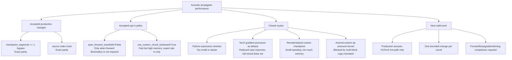

# Propagator Performance Master Plan

Date: 2026-06-02

This is the active plan for `bv1.2-propagator-performance`. Older per-round
records have been moved to `archive/` to avoid treating exploratory attempts as
current guidance.

## Goal

Improve acoustic propagator runtime without changing the default numerical
contract:

- forward waveform parity,
- loss parity,
- raw `vp` gradient parity,
- no silent change to output availability,
- no production use of experimental kernels before parity and real FWI timing.

## Current Baseline

Reference case:

```text
examples/validation/marmousi2_acoustic_full_record
device: npu:0
dtype: float32
checkpoint_segments: 1
full inversion anchor: 300 iterations
```

The stable full-record baseline is recorded in:

```text
docs/version-plans/bv1.2/full-record-marmousi2-baseline.md
```

## Current Map



## Rules

1. Do not restart broad scanning.
2. Do not optimize from archived per-round notes.
3. Do not promote benchmark-only custom kernels into production without full
   parity and real FWI timing.
4. Do not continue Ascend custom-op work inside production until block launch
   and copy parity are resolved independently.
5. Stop a line when measured gain is too small, memory cost is too high, or
   gradient parity is not exact enough.

## Next Direction

The next useful direction is a production-safe PyTorch acoustic hot-path change.

Candidate selection should start from the accepted summary, not from the old
round logs. A valid task should name:

- the exact production code path,
- expected performance mechanism,
- baseline command,
- parity checks,
- stop condition.

