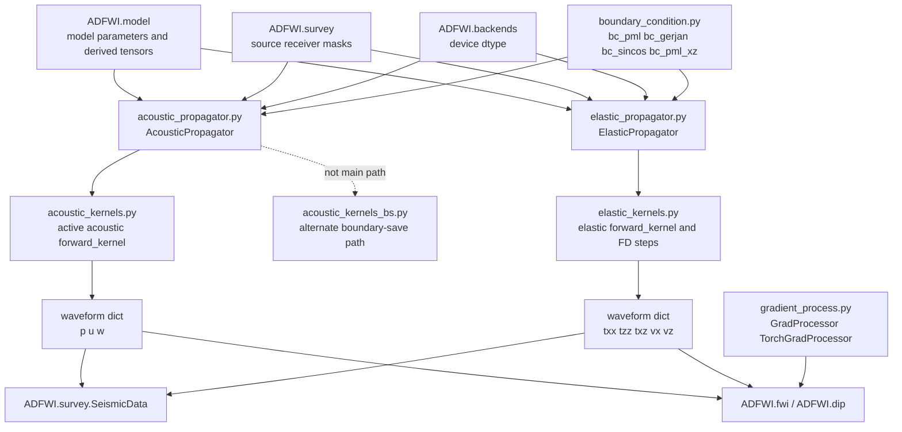
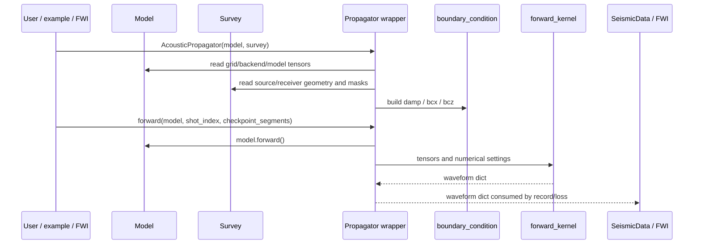

# Propagator Optimization Map

This map defines ownership boundaries for `ADFWI/propagator` before any code
optimization begins.

## Layer Map

## Responsibility Table

| Layer | Should own | Should not own |
| --- | --- | --- |
| `AcousticPropagator` | acoustic model/survey/backend adaptation, boundary tensor setup, acoustic kernel dispatch | finite-difference formulas, loss computation, waveform transforms |
| `ElasticPropagator` | elastic model/survey/backend adaptation, boundary tensor setup, elastic kernel dispatch | finite-difference formulas, loss computation, waveform transforms |
| acoustic/elastic kernels | wavefield update formulas, source injection, receiver sampling, checkpointed time stepping | model constraints, survey mutation, FWI loss, example IO |
| `boundary_condition.py` | deterministic boundary profile arrays from grid/ABC parameters | propagator dispatch, model mutation, waveform recording |
| `gradient_process.py` | gradient taper/smooth/mask/normalization utilities | forward wave propagation, survey geometry, loss formulas |
| `__init__.py` | stable public exports | compatibility-breaking reshuffles |

## Data Flow

## Shape And Device Contracts

| Quantity | Owner | Contract |
| --- | --- | --- |
| source locations | `Survey.Source` -> wrapper | normal source shape `(src_num, 2)`, converted to long tensor |
| receiver locations | `Survey.Receiver` -> wrapper | shape `(rcv_num, 2)`, converted to long tensor |
| source wavelet | `Survey.Source` -> wrapper | normal source shape `(src_num, nt)`, converted to propagator dtype/device |
| acoustic model tensors | `AcousticModel` -> acoustic wrapper | `vp`, `rho` on model/propagator backend |
| elastic model tensors | elastic model -> elastic wrapper | `lamu`, `lam`, `bx`, `bz`, `CC` prepared by `model.forward()` |
| receiver masks | `Survey` -> wrapper/FWI | stored on wrapper; FWI applies masks, forward kernels do not own mask semantics |
| waveform dict | kernel -> FWI/SeismicData | component arrays/tensors with `(shot, time, receiver)` convention |

## Risk Map

| Area | Risk | Preferred validation before editing |
| --- | --- | --- |
| wrapper docstrings/imports | low | `py_compile`, backend integration |
| public exports | medium | import tests and examples/validation import check |
| wrapper metadata extraction | medium | shape/device/dtype tests |
| boundary profile code | high | exact array comparison for profile outputs |
| checkpoint segmentation | high | forward and backward comparison between segment counts |
| active acoustic kernel | very high | reference forward and gradient validation |
| active elastic kernel | very high | component-wise reference forward and gradient validation |
| alternate acoustic boundary-save path | high | determine active users before touching |
| gradient processors | high | NumPy/torch comparison and inversion gradient tests |

## Recommended First Optimization

Start with wrapper readability and contract tests, not kernels.

The wrappers are the safest place to improve human readability because they sit
at the model/survey/backend boundary and are already covered by backend
integration tests. Kernel files should remain unchanged until a numerical
reference workflow is defined.

## Stop Boundary

This module should not repeat the earlier unbounded cleanup pattern. Stop each
round when the planned contract has been documented, validated, committed, and
pushed. Record adjacent issues as risks instead of immediately expanding scope.
