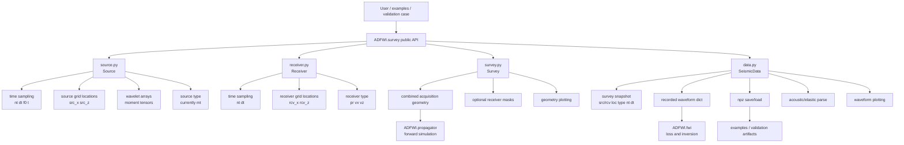
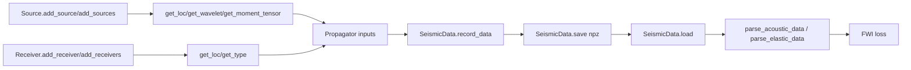

# Survey Optimization Map

This map shows the intended ownership boundaries for `ADFWI/survey`.

## Layer Map

## Responsibility Table

| File | Should Own | Should Not Own |
| --- | --- | --- |
| `source.py` | source time axis, source locations, source wavelets, moment tensors, source type metadata | receiver geometry, recorded data, propagator logic |
| `receiver.py` | receiver time axis, receiver locations, receiver type metadata | source wavelets, recorded data, propagator logic |
| `survey.py` | composition of source/receiver geometry, receiver mask metadata, acquisition plotting | waveform arrays, model data, loss/FWI logic |
| `data.py` | recorded waveform dictionaries, survey metadata snapshot, save/load, acoustic/elastic parse helpers, waveform plots | source/receiver mutation, propagator kernels, FWI loss logic |

## Data And Shape Contracts

Current commonly observed contracts:

| Object | Quantity | Expected shape |
| --- | --- | --- |
| `Source.get_loc()` normal source | source locations | `(src_num, 2)` |
| `Source.get_wavelet()` normal source | wavelets | `(src_num, nt)` |
| `Source.get_moment_tensor()` normal source | moment tensors | `(src_num, 3, 3)` |
| `Receiver.get_loc()` | receiver locations | `(rcv_num, 2)` |
| acoustic waveform data | `p`, `u`, `w` | `(src_num, nt, rcv_num)` in validation outputs |
| elastic waveform data | `txx`, `tzz`, `txz`, `vx`, `vz` | `(src_num, nt, rcv_num)` expected by parse/plot paths |
| receiver masks | `receiver_masks` | `(src_num, rcv_num)` |

## Risk Map

| Area | Risk | Validation Needed |
| --- | --- | --- |
| module docstrings/imports/error text | low | `py_compile`, focused construction smoke |
| `__repr__` cleanup | low-medium | empty/non-empty source/receiver/survey tests |
| source/receiver shape conversion | medium | focused shape tests and validation `check` |
| `get_type(unique=True)` ordering | medium | compatibility decision and tests |
| `SeismicData.record_data()` conversion | medium-high | exact waveform dict comparison |
| save/load `.npz` format | high | round-trip compatibility with existing files |
| receiver mask behavior | high | mask tests plus backend integration and forward comparison |
| plot orientation | medium | visual/output smoke only; avoid changing during core cleanup |

## Preferred First Optimization

Start by clarifying names, comments, docstrings, imports, and ownership without
changing array values or saved data format. That gives a stable reading path
before touching `SeismicData` or receiver mask behavior.

## Stop Boundary

Survey optimization should stop once source/receiver/survey/data contracts are
clear and covered by focused tests. Do not use this stage to reshape propagator
inputs, change receiver mask semantics, or migrate all examples.
