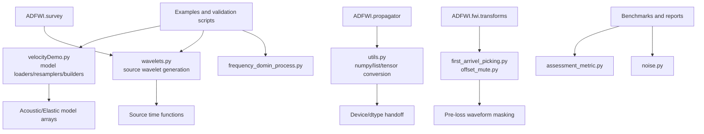

# Utils Optimization Map

This map defines the current `ADFWI/utils` helper layer and the intended
optimization boundaries.

## Helper Flow

## Ownership Boundaries

| Area | Owns | Does not own |
| --- | --- | --- |
| conversion helpers | lightweight array/list/tensor conversion compatibility | backend selection policy, model constraints |
| wavelet helper | analytic source time functions and time axis | survey geometry, source injection, propagation |
| model helpers | loading/resampling/smoothing demo datasets and synthetic models | `ADFWI.model` parameter constraints |
| mute helpers | legacy waveform masking formulas | transform pipeline orchestration |
| frequency helpers | spectrum/filter plotting utilities | FWI multiscale filtering policy |
| metric helpers | post-run model-quality metrics | optimization objective functions |
| noise helper | reproducible synthetic Gaussian noise | survey acquisition geometry |

## Current Public Surface

The current package-level imports are broad because examples historically use
`from ADFWI.utils import ...`.

Keep this public surface stable during the first cleanup stage. Narrowing it
requires an example/notebook migration plan and an import-surface test.

## Risk Levels

| Change | Risk | Required validation |
| --- | --- | --- |
| docstrings only | low | `py_compile`, import smoke |
| duplicate export cleanup | low-medium | import smoke and examples/test grep |
| tensor conversion behavior | high | dtype/device/gradient unit tests plus propagator smoke |
| wavelet formula or defaults | high | numerical reference values plus validation forward comparison |
| Marmousi/Overthrust/Valhall/Hess helpers | high | dataset-shape/unit checks plus affected example validation |
| mute helper behavior | high | legacy-vs-transform parity tests |
| metrics/noise edge cases | medium | focused deterministic unit tests |

## Recommended Next Round

Start with a minimal readability pass:

- add a clear package docstring to `ADFWI/utils/__init__.py`;
- organize imports visually without changing exported names;
- remove only the duplicate `get_linear_vel_model` export if import smoke and
  grep show no behavior impact.

Stop after that round and validate. Do not enter `velocityDemo.py` internals
until conversion and wavelet contracts are covered by tests.

