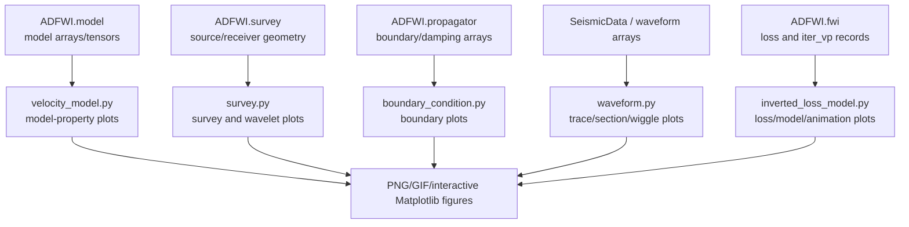

# View Optimization Map

This map describes how `ADFWI/view` should fit into the framework.

## Plotting Flow

## Ownership Boundaries

| File | Owns | Does not own |
| --- | --- | --- |
| `velocity_model.py` | `vp/rho/vs/eps/delta/gamma/lambda/mu` image plots | model constraints, parameter conversion, velocity formulas |
| `waveform.py` | trace, section, wiggle plotting helpers | FWI waveform normalization policy, mute/filter transforms |
| `survey.py` | acquisition geometry and source wavelet plots | survey state mutation, receiver/source selection |
| `boundary_condition.py` | boundary/damping visualizations | boundary-condition generation |
| `inverted_loss_model.py` | inversion-result plotting and animation | optimizer state, loss computation |
| `observed_system.py` | colorbar helper and legacy archived plotting code | public survey plotting API |
| `__init__.py` | stable public plotting namespace | wildcard expansion beyond known public helpers |

## Public Surface To Preserve

Current direct exports include:

- `plot_waveform2D`
- `plot_waveform_wiggle`
- `plot_waveform_trace`
- `plot_vp_rho`
- `plot_vp_vs_rho`
- `plot_eps_delta_gamma`
- `plot_lam_mu`
- `plot_model`
- `plot_bcx_bcz`
- `plot_damp`
- `plot_survey`
- `plot_wavelet`
- functions imported from `inverted_loss_model.py`

The first cleanup should preserve these names even if `__init__.py` becomes
more explicit.

## Risk Levels

| Change | Risk | Required validation |
| --- | --- | --- |
| module docstrings/import cleanup | low | `py_compile`, import smoke |
| explicit package exports | low-medium | import smoke for all public names |
| plotting bug fix | medium | focused plotting test and figure creation check |
| waveform normalization behavior | high | before/after array comparison and caller audit |
| changing axes, units, or orientation | high | image smoke plus validation figure review |
| removing legacy files or names | high | repository-wide import/caller migration |

## Recommended First Code Round

Add `tests/test_view_contracts.py` with smoke tests for the public plot helpers.
Keep arrays tiny and save into temporary directories.

For headless testing, the test file may select a non-interactive Matplotlib
backend before importing `ADFWI.view`. Do not set the backend inside
`ADFWI/view` itself.

After that, fix only the confirmed `plot_eps_delta_gamma()` axis bug and make
`ADFWI/view/__init__.py` explicit if the tests pass.
