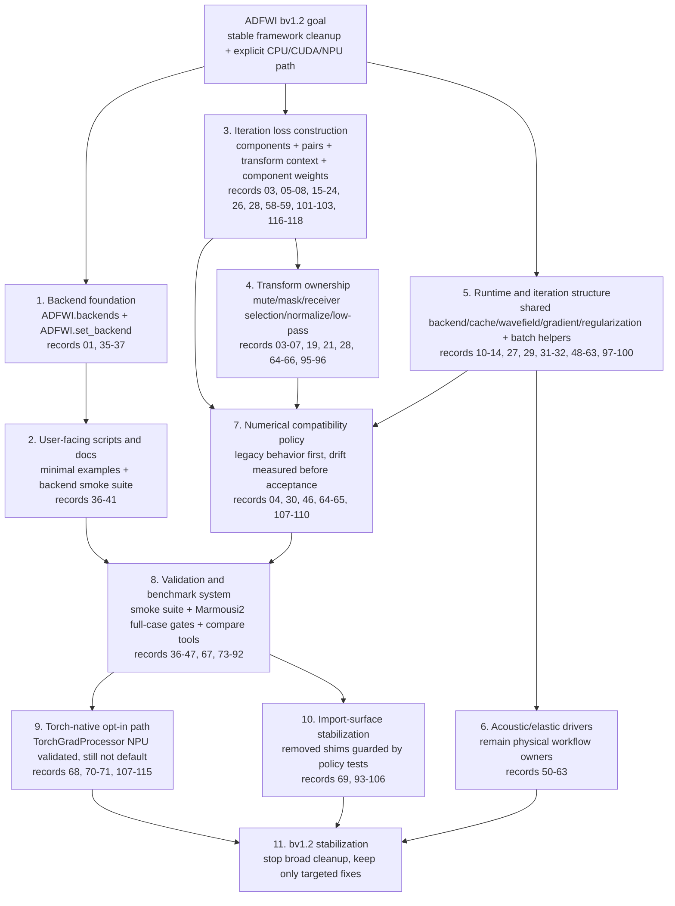

# ADFWI bv1.2 Optimization Chain

This document is the high-level summary of the `bv1.2` optimization branch. It
is intentionally written from top-level goals down to low-level implementation
surfaces so the current framework state can be understood without reading every
numbered record.

Detailed engineering records remain in `docs/version-plans/bv1.2/`.

## Current Status

`bv1.2` is now in a **stabilization phase**.

The main framework optimization goals have been completed:

- CPU/CUDA/NPU backend selection is explicit and shared.
- FWI loss construction is merged into the iteration layer.
- Acoustic and elastic FWI loops share runtime and iteration helpers.
- Historical compatibility shims have been removed or narrowed.
- Real Marmousi2 NPU full-case gates exist for forward-plus-inversion checks.
- `TorchGradProcessor` is validated as an explicit NPU opt-in path, while the
  default remains the legacy `GradProcessor`.

Further work should not be open-ended cleanup. New changes should be accepted
only when they fix a bug, clarify a public contract, improve reproducibility, or
target a measured performance bottleneck.

## Top-Down Chain



## Major Optimization Layers

| Layer | What Changed | Current Contract | Validation |
| --- | --- | --- | --- |
| Backend/device | Added centralized backend configuration, diagnostics, dtype/device handling, and FWI constructor guards. | Users configure CPU/CUDA/NPU once through the backend API before building models/FWI drivers. | `tests/test_backends.py`, `tests/test_backend_integration.py`, backend smoke scripts. |
| User-facing examples | Added minimal acoustic/elastic backend examples and a layered smoke runner. | Script examples are reproducible entry points for backend checks, not notebook replacements. | `scripts/smoke/run_backend_smoke_suite.py`, `scripts/examples/README.md`. |
| Iteration loss construction | Moved the former FWI data-contract helpers into `ADFWI.fwi.iteration.loss`. | `loss.py` owns loss-input records, component selection, pre-loss pair preparation, misfit dispatch, and weighting; `step.py` owns one-batch forward/loss/backward execution. | `tests/test_fwi_iteration_loss.py`, `tests/test_fwi_iteration.py`. |
| Transform pipeline | Moved mute, masks, receiver selection, normalization, and low-pass behavior into transform-owned modules. | Receiver selection runs before transform pipelines; transform order is part of the numerical contract. | `tests/test_data_transforms.py`, receiver-selection tests, low-pass comparisons. |
| Runtime helpers | Extracted shared backend checks, cache, wavefield collection, gradient dispatch, and regularization helpers. | Acoustic/elastic drivers still own physical parameter choices; helpers own repeated execution details. | `tests/test_fwi_runtime.py`, mini-inversion smoke tests. |
| Iteration helpers | Extracted batch ranges, loss accumulation, progress, epoch update, and epoch finalization helpers. | FWI loops are shorter but still readable as inversion workflows. | Iteration/runtime unit tests and acoustic/elastic FWI smoke paths. |
| Compatibility cleanup | Removed thin historical shims and broad re-export surfaces after moving active code to canonical paths. | `bv1.1` remains the legacy compatibility branch; `bv1.2` uses canonical imports. | `tests/test_import_surface_policy.py`. |
| Marmousi2 full-case gates | Added full-case output artifacts, compare CLI, preset runner, post-run compare, and profiling option. | Fixed 3-shot and 5-shot NPU baselines are the reference gates for future changes. | `tests/full_cases/`, `scripts/benchmark/run_marmousi2_full_case.py`, `compare_full_case_outputs.py`. |
| Torch gradient path | Added `TorchGradProcessor`, parity tests, stage diagnostics, NPU tolerance profile, and Marmousi2 opt-in gates. | NPU-validated opt-in path; legacy `GradProcessor` remains default. | `tests/test_torch_grad_processor.py`, gradient benchmarks, records 107-115. |

## Code Landing Points

| Path | Stabilized Role |
| --- | --- |
| `ADFWI/backends/` | Backend/device/dtype selection and diagnostics. |
| `ADFWI/fwi/transforms/` | Waveform operations: receiver selection, masks, mute, normalization, low-pass. |
| `ADFWI/fwi/iteration/` | Namespace package for batch scheduling, loss, epoch, and progress helpers. Import concrete helpers from owner modules. |
| `ADFWI/fwi/iteration/batches.py` | Shot batch scheduling, `BatchRange` records, and batch progress labels. |
| `ADFWI/fwi/iteration/loss.py` | Loss-input records, component selection, pre-loss pair preparation, misfit dispatch, and weighted loss accumulation. |
| `ADFWI/fwi/iteration/step.py` | One-batch acoustic/elastic forward, loss evaluation, regularization merge, backward, and wavefield accumulation. |
| `ADFWI/fwi/iteration/epoch.py` | Epoch optimizer/scheduler/model update plus epoch progress/cache finalization. |
| `ADFWI/fwi/runtime/` | Namespace package for backend/cache/forward/gradient/regularization/wavefield helpers. |
| `ADFWI/fwi/multiscale/` | Explicit legacy-compatible multiscale low-pass implementation. |
| `ADFWI/propagator/gradient_process.py` | Legacy `GradProcessor` and opt-in `TorchGradProcessor`. |
| `scripts/smoke/` | Layered backend and FWI smoke checks. |
| `scripts/examples/` | Reproducible researcher-facing examples. |
| `scripts/benchmark/` | Marmousi2 presets, comparison tools, benchmark/profiling entry points. |
| `tests/full_cases/` | Explicit opt-in real-case gates and saved artifact location. |

## Numerical Policy

The main numerical rule in `bv1.2` is:

> Preserve legacy behavior unless a new numerical path has focused tests,
> recorded drift, and a real-case comparison.

Concrete decisions:

- Legacy low-pass and multiscale behavior remain explicit.
- Historical L2 behavior is documented; safer alternatives are separate paths.
- Receiver selection order is fixed before transform pipelines.
- `TorchGradProcessor` is accepted as an opt-in NPU path, not as a default
  replacement.
- NPU float32 `conv2d` smoothing drift is known and recorded; strict benchmark
  tolerance remains the default, while `npu-float32` is explicit.

## TorchGradProcessor Status

`TorchGradProcessor` has completed the intended bv1.2 validation sequence:

| Gate | Result |
| --- | --- |
| Focused parity tests | Passed for normalization, masks, smoothing, illumination, list dispatch. |
| Stage diagnostics | NPU drift localized to float32 smoothing/illumination convolution. |
| NPU tolerance profile | Added explicit `npu-float32`; strict remains default. |
| Marmousi2 mask-only one-step | Matched legacy. |
| Marmousi2 smoothing one-step | No loss drift; update drift about `1e-6` relative scale. |
| Marmousi2 illumination one-step | No loss drift; update drift about `1e-7` relative scale. |
| Marmousi2 3-shot/10-iteration smoothing | Stable; final-loss relative drift about `3e-6`. |
| Marmousi2 3-shot/10-iteration illumination | Stable; final loss identical. |

Status:

- **Validated:** yes, as an opt-in NPU path.
- **Default replacement:** no.
- **More gradient tests:** not needed unless gradient post-processing code
  changes or a default-path migration is explicitly proposed.

## Validation Commands

Use the `adfwi` conda environment.

Lightweight stabilization checks:

```bash
conda run -n adfwi python -m unittest tests/test_backends.py tests/test_backend_integration.py
conda run -n adfwi python -m unittest tests/test_data_transforms.py tests/test_fwi_iteration_loss.py
conda run -n adfwi python -m unittest tests/test_fwi_runtime.py tests/test_import_surface_policy.py
conda run -n adfwi python -m unittest tests/test_receiver_selection.py tests/test_torch_grad_processor.py
conda run -n adfwi python -m unittest tests/test_marmousi2_full_case_presets.py tests/test_full_case_output_compare.py
```

Smoke and benchmark entry points:

```bash
conda run -n adfwi python scripts/smoke/run_backend_smoke_suite.py --suites public,misfit,examples --devices cpu,npu:0
conda run -n adfwi python scripts/benchmark/gradient_processor_benchmark.py --device cpu --warmup 0 --repeat 1 --nx 8 --nz 6
conda run -n adfwi python scripts/benchmark/run_marmousi2_full_case.py shot3 --dry-run
```

Heavy real-case gates remain opt-in:

```bash
ADFWI_RUN_FULL_CASES=1 conda run -n adfwi python -m unittest tests/full_cases/test_marmousi2_acoustic_full_flow.py
conda run -n adfwi python scripts/benchmark/run_marmousi2_full_case.py shot3 --overwrite
conda run -n adfwi python scripts/benchmark/run_marmousi2_full_case.py shot5 --overwrite
```

For changes touching numerical FWI paths, run focused unit tests plus a saved
Marmousi2 comparison and record drift in `docs/version-plans/bv1.2/`.

## Stabilization Rules

Do not continue optimizing by default. New changes should meet at least one of
these conditions:

1. Fix a concrete bug or failing test.
2. Clarify a public API or user-facing workflow.
3. Reduce a measured performance bottleneck.
4. Strengthen regression coverage for an already-stabilized contract.
5. Prepare release/stabilization documentation.

Avoid:

- broad cleanup without a specific risk;
- more gradient-processor trajectory tests without a code change;
- changing transform order, loss-input shape, or receiver selection semantics
  without a numerical comparison;
- moving public import surfaces unless the import policy is updated and tested.

## Remaining Useful Work

The useful remaining work is limited and should be treated as release
stabilization, not open-ended optimization:

1. Run the lightweight stabilization test set before merging or tagging.
2. Keep `TorchGradProcessor` documented as NPU-validated opt-in.
3. Use fixed Marmousi2 3-shot/5-shot gates only to validate concrete changes.
4. If performance work resumes, start from operator-level profiling of the fixed
   `shot3` NPU baseline.
5. If iteration loss work resumes, keep it small and behavior-preserving.
