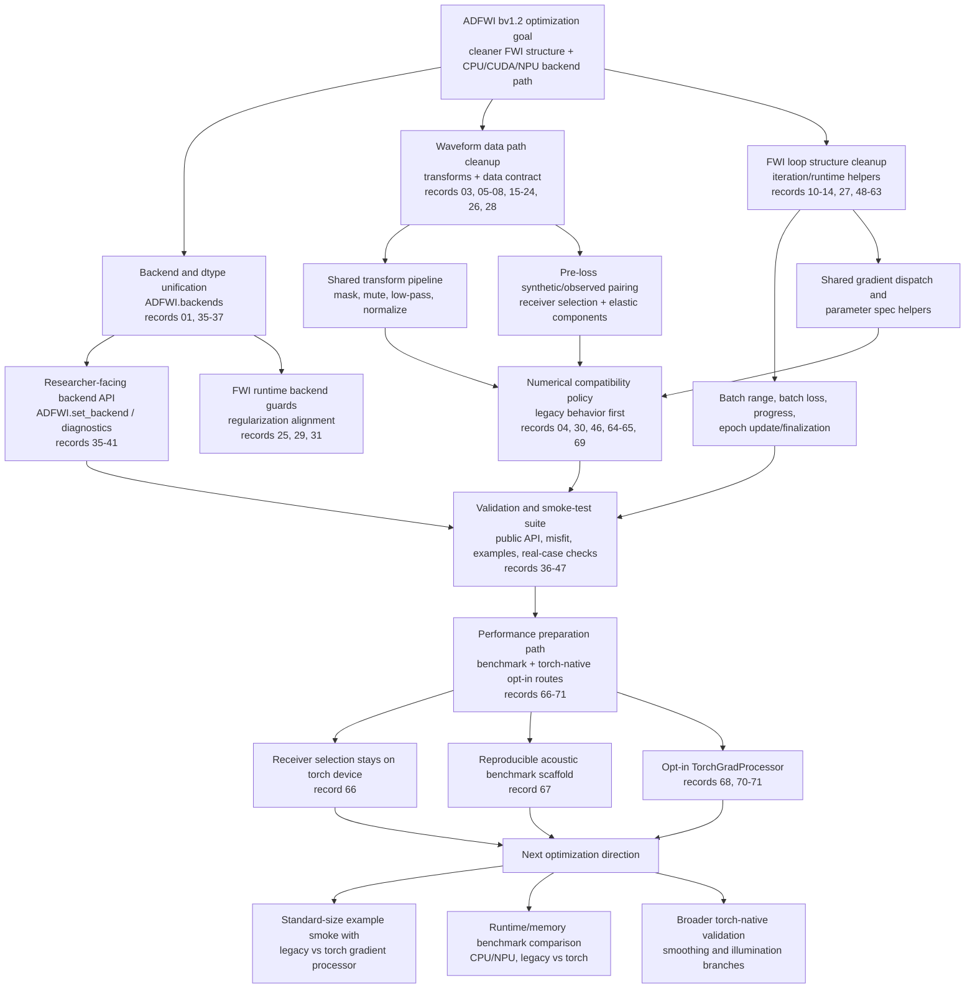

# ADFWI bv1.2 Optimization Chain

This document summarizes the optimization path already completed on the `bv1.2`
branch. The detailed engineering records remain under
`docs/version-plans/bv1.2/`; this page is the high-level chain for quickly
understanding how the work fits together.

## Chain Diagram



## Layered Summary

| Layer | Goal | Representative changes | Result | Main validation entry |
| --- | --- | --- | --- | --- |
| Backend/device | Make CPU, CUDA, and NPU selection explicit and consistent. | `ADFWI.backends`, top-level `ADFWI.set_backend(...)`, diagnostics, backend guards. | Research scripts can configure device/dtype once before building models and FWI drivers. | `tests/test_backends.py`, `tests/test_backend_integration.py`, public backend smoke. |
| Data/transforms | Move waveform preprocessing out of ad hoc FWI branches. | Transform pipeline, shared normalization formula, mute/mask/receiver selection helpers. | Synthetic and observed traces now pass through structured preparation before loss evaluation. | `tests/test_data_transforms.py`, receiver-selection tests, FWI data contract tests. |
| Loss contract | Make loss inputs explicit before misfit calculation. | Synthetic/observed loss records, elastic component selection, weighted component sum. | Acoustic and elastic drivers keep physical choices visible while sharing bookkeeping. | FWI data contract and runtime unit tests. |
| Iteration/runtime | Reduce acoustic/elastic duplication without hiding the inversion story. | Batch range/loss/progress helpers, cache/wavefield helpers, epoch finalization, parameter specs. | FWI drivers remain readable algorithm drivers with shared execution details factored out. | FWI runtime tests and mini-inversion smoke scripts. |
| Numerical policy | Preserve legacy numerical behavior unless drift is measured and accepted. | Legacy-compatible low-pass ownership, stable L2 notes, compatibility shim cleanup. | Structural cleanup does not silently change inversion results. | Low-pass comparisons, smoke drift checks, focused numerical unit tests. |
| Smoke/benchmark tooling | Make optimization measurable before deeper performance changes. | Layered smoke runner, minimal acoustic/elastic examples, Marmousi2 checks, acoustic benchmark scaffold. | Backend and FWI changes have repeatable commands for CPU/NPU checks. | `scripts/smoke/run_backend_smoke_suite.py`, `scripts/benchmark/acoustic_backend_benchmark.py`. |
| Torch-native opt-ins | Introduce performance-oriented torch paths without replacing legacy defaults. | Torch receiver indexing, `TorchGradProcessor`, example and smoke flags. | New paths can be tested against legacy numerics before becoming defaults. | `tests/test_receiver_selection.py`, `tests/test_torch_grad_processor.py`, acoustic gradient smoke. |

## Current Code Landing Points

| Path | Role in the chain |
| --- | --- |
| `ADFWI/backends/` | Public and internal backend/device/dtype selection. |
| `ADFWI/fwi/transforms/` | Waveform preprocessing: masks, mute, low-pass, normalization, receiver selection. |
| `ADFWI/fwi/data/` | Loss-input records, component selection, and weighted loss preparation. |
| `ADFWI/fwi/iteration/` | Batch ranges, batch loss accumulation, and progress helpers. |
| `ADFWI/fwi/runtime/` | Shared execution glue for backend checks, regularization, wavefield handling, and gradients. |
| `ADFWI/fwi/multiscale/` | Legacy-compatible multiscale low-pass implementation. |
| `ADFWI/propagator/gradient_process.py` | Legacy NumPy gradient processor and opt-in torch-native processor. |
| `scripts/smoke/` | Repeatable backend/FWI smoke checks. |
| `scripts/examples/` | Minimal researcher-facing backend examples. |
| `scripts/benchmark/` | Reproducible benchmark entry points for performance comparison. |

## Validation Commands

Use the `adfwi` conda environment for the current bv1.2 validation path:

```bash
conda run -n adfwi python -m unittest tests/test_backends.py tests/test_backend_integration.py
conda run -n adfwi python -m unittest tests/test_data_transforms.py tests/test_fwi_data_contract.py tests/test_fwi_runtime.py
conda run -n adfwi python -m unittest tests/test_receiver_selection.py tests/test_torch_grad_processor.py
conda run -n adfwi python scripts/smoke/run_backend_smoke_suite.py --suites public,misfit,examples --devices cpu,npu:0
conda run -n adfwi python scripts/benchmark/acoustic_backend_benchmark.py --device cpu --warmup 1 --repeat 3
conda run -n adfwi python scripts/benchmark/acoustic_backend_benchmark.py --device cpu --warmup 1 --repeat 3 --gradient-processors legacy,torch
conda run -n adfwi python -m unittest tests/full_cases/test_marmousi2_acoustic_full_flow.py
ADFWI_RUN_FULL_CASES=1 conda run -n adfwi python -m unittest tests/full_cases/test_marmousi2_acoustic_full_flow.py
```

For changes touching FWI core data, loss, gradient, regularization, or iteration
logic, run both focused unit tests and a smoke comparison. If the change alters a
numerical method, record the drift and tolerance in
`docs/version-plans/bv1.2/`.

## Next Optimization Direction

1. Use the examples smoke profile with `--example-gradient-processors legacy,torch`
   to collect standard-size CPU/NPU legacy-vs-torch drift before larger runs.
2. Run `scripts/benchmark/acoustic_backend_benchmark.py` with
   `--gradient-processors legacy,torch` on NPU and larger acoustic grids.
3. Build the next Marmousi2 NPU baseline around full-length synthetic-true
   observations because the 300-sample reduced window is not representative of
   notebook-like inversion settings.
4. Use `tests/full_cases/` as the gate for forward-plus-inversion real-case
   validation before larger optimization changes.
5. Treat the 3-shot, 10-iteration, full-length synthetic-true Marmousi2 NPU gate
   with `checkpoint_segments=10` as the fastest current per-iteration baseline;
   it preserved monotonic loss and averaged about `31.36s/iteration`.
6. Treat the 5-shot, 10-iteration, `checkpoint_segments=10` run as the current
   throughput stress baseline; it remained stable at about `31.86s/iteration`
   with higher NPU memory allocation.
7. Next increase the shot count again, such as to 7 shots, while keeping
   `checkpoint_segments=10` to locate the NPU throughput and memory knee.
8. Validate the torch-native gradient processor through smoothing and
   illumination branches before considering any default-path migration.
9. Convert example options into a small reproducible configuration layer once
   the benchmark dimensions and smoke profiles stabilize.
10. Defer deeper propagator-level performance work, such as checkpointing or
   compile-oriented kernels, until the current benchmark baseline is populated.
