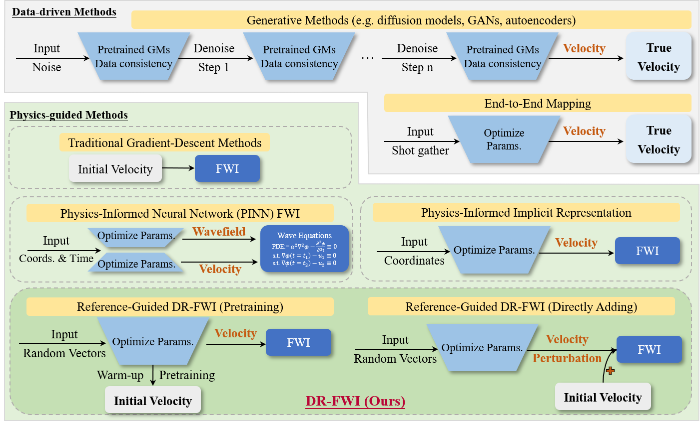
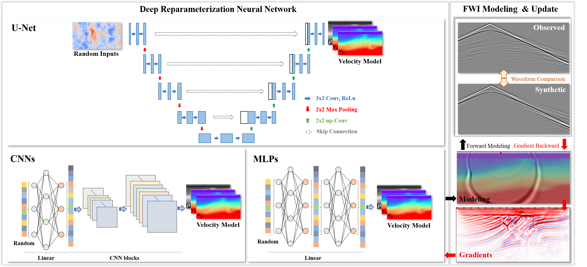
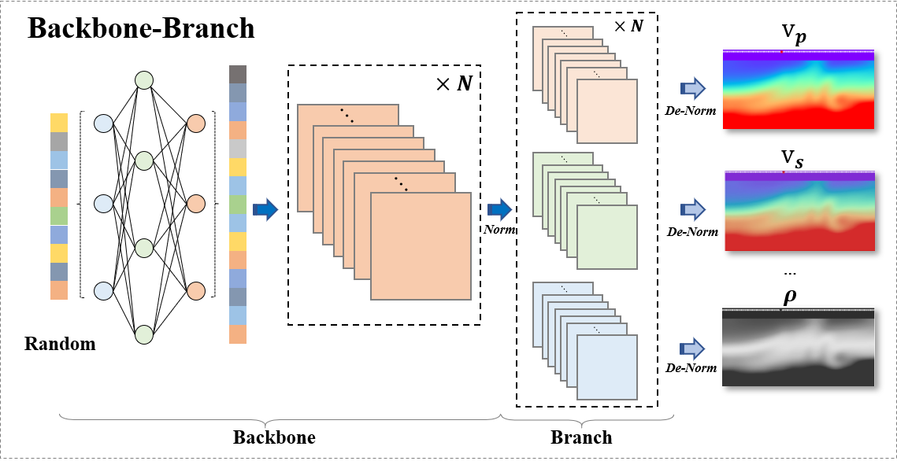
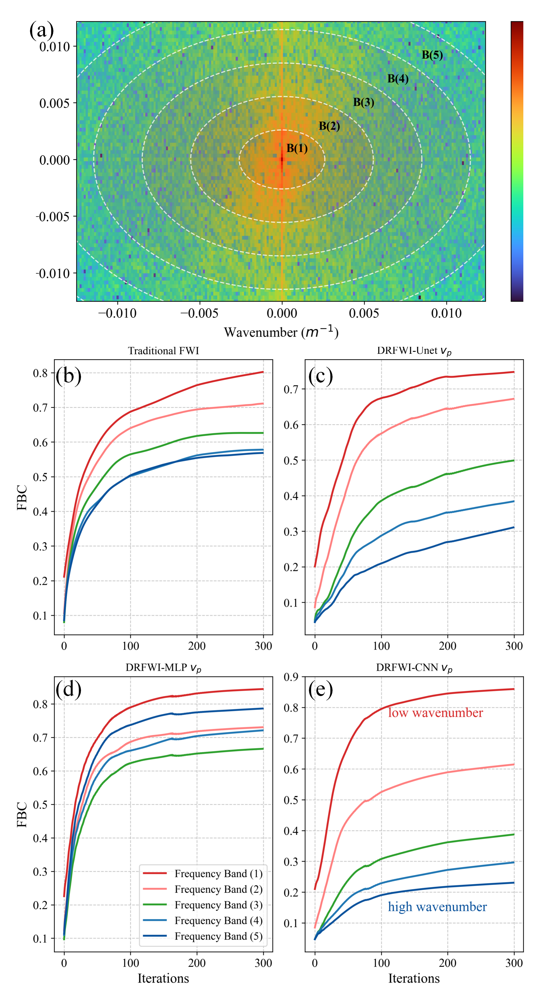

---

## DR-FWI: Deep Reparameterization for Full Waveform Inversion

:triangular_flag_on_post: Latest Update (April 2025)

- The corresponding implementation has been released on [GitHub](https://github.com/liufeng2317/ADFWI/tree/bv1.1/examples/DR-FWI).

- Our preprint entitled “Deep Reparameterization for Full Waveform Inversion: Architecture Benchmarking, Robust Inversion, and Multiphysics Extension” is now available on [arXiv](https://arxiv.org/abs/2504.17375).

---

## 📰 Introduction

<div align="center">
  
  <p> Comparison of data-driven and physics-driven methods.</p>
</div>

**DR-FWI** introduces a deep learning-based reparameterization framework for Full Waveform Inversion (FWI), replacing direct parameter optimization with neural representations. By encoding subsurface structures into neural networks, DR-FWI enables more flexible, robust, and accurate inversion. Key contributions include:

### 1. 🔧 Architecture Benchmarking and Reference Integration
We systematically benchmark multiple neural architectures (CNN, MLP, U-Net) and strategies for integrating reference velocity models:
- **Shallow CNNs** outperform deeper variants and traditional FWI, capturing geological complexity more effectively.
- **Stepwise embedding** of reference models consistently improves inversion accuracy over direct model superposition.
- These insights guide practical architecture design and reference incorporation in real-world scenarios.

<div align="center">
  
  <p>DR-FWI workflow</p>
</div>

### 2. 🛡️ Robust Inversion under Sparse and Noisy Conditions
DR-FWI remains highly effective even under challenging conditions:
- Works well with extremely **sparse data** (e.g., 10 sources × 20 receivers).
- Maintains performance under **strong noise** (e.g., Gaussian noise with 6× standard deviation).
- Significantly outperforms conventional FWI in accuracy and stability, enabling applications in data-limited and cost-sensitive environments.

### 3. 🔁 Multiphysics Joint Inversion via Adaptive Backbone–Branch Network
We propose a unified **backbone–branch** network for multiparameter inversion:
- A **shared backbone** captures common structural features.
- Separate **branches** learn parameter-specific details (e.g., $v_p$, $v_s$, $\rho$), with normalization tailored to each.
- Demonstrated on synthetic and Marmousi2 models, this architecture significantly reduces parameter crosstalk, offering a scalable solution for multiphysics joint inversion.

<div align="center">
  
  <p>"Backbone–branch" architecture for joint inversion of multiple physical parameters.</p>
</div>

### 4. ⚙️ Mechanistic Insights into Deep Reparameterization

We reveal the underlying mechanism that explains why deep reparameterization enhances FWI stability and accuracy. Through spectral dynamics analysis, DR-FWI is shown to impose implicit frequency regularization, consistent with the “spectral bias” observed in deep neural networks.
- **Progressive frequency learning**: Neural representations first reconstruct low-wavenumber (large-scale) structures and gradually recover high-wavenumber details, forming a natural low-to-high frequency learning sequence.
- **Implicit regularization**: This spectral bias acts as a built-in regularizer, preventing convergence to local minima and improving robustness against noise and poor initial models.
- **Architecture-dependent dynamics**: CNNs and U-Nets exhibit stronger low-frequency preference than MLPs, leading to smoother and more geologically consistent inversion results.

These findings bridge empirical observations with theoretical understanding, demonstrating that deep reparameterization functions as an implicit hierarchical spectral regularizer in FWI.

<div align="center">

  
  <p>Frequency-Band Correspondence (FBC) analysis for conventional FWI and DR-FWI.</p>
</div>

---

## 📦 Examples

### DRFWI-based Multiparameter Inversion

#### Step1: load required library

```python
import os

import ADFWI
import numpy as np
import torch
import matplotlib.pyplot as plt
from scipy import integrate
from tqdm import tqdm

from ADFWI.dip import DIP_ElasticFWI
from ADFWI.propagator import ElasticPropagator, GradProcessor
from ADFWI.survey import Receiver, SeismicData, Source, Survey
from ADFWI.utils import (
    get_smooth_marmousi_model,
    load_marmousi_model,
    numpy2tensor,
    resample_marmousi_model,
    wavelet,
)
```

#### Step 2: set theparameters for velocity model

```python
project_path = "./data/"
for subdir in ("model", "waveform", "survey", "inversion-vp_vs_rho-CNN3-2x64-1"):
    os.makedirs(os.path.join(project_path, subdir), exist_ok=True)

#------------------------------------------------------
#                   Basic Parameters
#------------------------------------------------------
device = "cuda:0"         # Specify the CPU/GPU/NPU device
dtype = torch.float32     # Set data type to 32-bit floating point
backend = ADFWI.set_backend(device, dtype=dtype)
ox, oz = 0, 0             # Origin coordinates for x and z directions
nz, nx = 68, 200          # Grid dimensions in z and x directions
dx, dz = 45, 45           # Grid spacing in x and z directions
nt, dt = 2500, 0.003      # Time steps and time interval
nabc = 50                 # Thickness of the absorbing boundary layer
f0 = 5                    # Initial frequency in Hz
free_surface = True       # Enable free surface boundary condition

#------------------------------------------------------
#                   Velocity Model
#------------------------------------------------------
# Load the Marmousi model dataset from the specified directory.
marmousi_model = load_marmousi_model(in_dir="../datasets/marmousi2_source")

# Resample the Marmousi model for the defined coordinates
x = np.linspace(5000, 5000 + dx * nx, nx)
z = np.linspace(500, 500+dz * nz, nz)
vel_model = resample_marmousi_model(x, z, marmousi_model)

vp_true  = vel_model['vp'].T
vs_true  = vel_model['vs'].T
rho_true = vel_model['rho'].T

smooth_model= get_smooth_marmousi_model(vel_model,gaussian_kernel=4,mask_extra_detph=0)
vp_init     = smooth_model['vp'].T
vs_init     = smooth_model['vs'].T
rho_init    = smooth_model['rho'].T
```

#### Step3: pretrain a DNN to learn the initial velocity model (pretraining-based strategy)

```python

# -----------------------------------
#     Define DIP model
# -----------------------------------
from ADFWI.dip.model_multi.CNNv2 import CNNs as DIP_CNN
model_shape = [nz,nx]
DIP_model  = DIP_CNN(model_shape,
                    random_state_num=100,
                    backbone_channels=[64,64],
                    branches_channels = [1],
                    branches_number=3,
                    vmins=[vp_true.min()/1000,vs_true.min()/1000,rho_true.min()/1000] ,
                    vmaxs=[vp_true.max()/1000,vs_true.max()/1000,rho_true.max()/1000],
                    units=[1000,1000,1000],device=device)
DIP_model.to(device)

# -----------------------------------
#     Pretrain DIP model
# -----------------------------------
pretrain        = True
load_pretrained = False

if pretrain:
    if load_pretrained:
        # load the model parameters
        DIP_model.load_state_dict(torch.load(os.path.join(project_path,f"inversion-vp_vs_rho-CNN3-2x64-1/DIP_model_vp_vs_rho_pretrained.pt")))
    else:
        lr          = 0.0005
        iteration   = 10000
        step_size   = 1000
        gamma       = 0.5
        optimizer = torch.optim.Adam(DIP_model.parameters(),lr = lr)
        scheduler = torch.optim.lr_scheduler.StepLR(optimizer,step_size=step_size,gamma=gamma)
        vp_init = numpy2tensor(vp_init,dtype=dtype).to(device)
        vs_init = numpy2tensor(vs_init,dtype=dtype).to(device)
        rho_init = numpy2tensor(rho_init,dtype=dtype).to(device)
        pbar = tqdm(range(iteration+1))
        for i in pbar:  
            vp_nn,vs_nn,rho_nn = DIP_model()
            loss = torch.sqrt(torch.sum((vp_nn - vp_init)**2)) + torch.sqrt(torch.sum((vs_nn - vs_init)**2))+ torch.sqrt(torch.sum((rho_nn - rho_init)**2))
            optimizer.zero_grad()
            loss.backward()
            optimizer.step()
            scheduler.step()
            pbar.set_description(f'Pretrain Iter:{i}, Misfit:{loss.cpu().detach().numpy()}')
        torch.save(DIP_model.state_dict(),os.path.join(project_path,f"inversion-vp_vs_rho-CNN3-2x64-1/DIP_model_vp_vs_rho_pretrained.pt"))

# -----------------------------------
#     velocity model for FWI
# -----------------------------------
from ADFWI.dip.dip_elastic_model_vp_vs_rho import DIP_ElasticModel_vp_vs_rho
model = DIP_ElasticModel_vp_vs_rho(ox,oz,nx,nz,dx,dz,
                        DIP_model=DIP_model,
                        vp_init=vp_init,
                        vs_init=vs_init,
                        rho_init=rho_init,
                        vp_bound =[vp_true.min(),vp_true.max()],
                        vs_bound =[vs_true.min(),vs_true.max()],
                        rho_bound=[rho_true.min(),rho_true.max()],
                        free_surface=free_surface,
                        abc_type="PML",abc_jerjan_alpha=0.007,nabc=nabc,
                        auto_update_rho=False, auto_update_vp=False,
                        device=device,dtype=dtype)
print(model.__repr__())
model.save(os.path.join(project_path,"model/init_model.npz"))
```

#### Step 4: Set Observed System Parameters

```python
#------------------------------------------------------
#                   Source And Receiver
#------------------------------------------------------
# source    
src_z = np.array([2 for i in range(2, nx-1, 5)])  # Z-coordinates for sources
src_x = np.array([i for i in range(2, nx-1, 5)])  # X-coordinates for sources
src_t,src_v = wavelet(nt,dt,f0,amp0=1)
src_v = integrate.cumtrapz(src_v, axis=-1, initial=0) #Integrate
source = Source(nt=nt,dt=dt,f0=f0)
for i in range(len(src_x)):
    source.add_source(src_x=src_x[i],src_z=src_z[i],src_wavelet=src_v,src_type="mt",src_mt=np.array([[1,0,0],[0,1,0],[0,0,1]]))
source.plot_wavelet(save_path=os.path.join(project_path,"survey/wavelets.png"),show=False)

# receiver
rcv_z = np.array([2 for i in range(0, nx, 1)])  # Z-coordinates for receivers
rcv_x = np.array([j for j in range(0, nx, 1)])  # X-coordinates for receivers
receiver = Receiver(nt=nt,dt=dt)
for i in range(len(rcv_x)):
    receiver.add_receiver(rcv_x=rcv_x[i],rcv_z=rcv_z[i],rcv_type="pr")

# survey
survey = Survey(source=source,receiver=receiver)
print(survey.__repr__())
survey.plot(model.vp,cmap='coolwarm',save_path=os.path.join(project_path,"survey/observed_system_init.png"),show=False)
```

#### Step 5: Waveform Propagator and Inversion
```python
#------------------------------------------------------
#                   Waveform Propagator
#------------------------------------------------------
F = ElasticPropagator(model,survey,device=device)

# load data
d_obs = SeismicData(survey)
d_obs.load(os.path.join(project_path,"waveform/obs_data.npz"))
print(d_obs.__repr__())

# optimizer
iteration   =   300
optimizer   =   torch.optim.Adam(model.parameters(), lr = 0.0001)
scheduler   =   torch.optim.lr_scheduler.StepLR(optimizer,step_size=100,gamma=0.75,last_epoch=-1)

# Setup misfit function
from ADFWI.fwi.misfit import Misfit_global_correlation
from ADFWI.fwi.regularization import regularization_TV_2order
loss_fn = Misfit_global_correlation(dt=1)
regularization_fn = regularization_TV_2order(nx,nz,dx,dz,step_size=50,gamma=0.9,device=device,dtype=dtype)

# gradient processor
grad_mask             = np.ones((nz,nx))
gradient_processor_vp = GradProcessor(grad_mask=grad_mask,forw_illumination=False,norm_grad=True,grad_smooth=0)
gradient_processor_vs = GradProcessor(grad_mask=grad_mask,forw_illumination=False,norm_grad=True,grad_smooth=0)
gradient_processor_rho= GradProcessor(grad_mask=grad_mask,forw_illumination=False,norm_grad=True,grad_smooth=0)
gradient_processor = [gradient_processor_vp,gradient_processor_vs,gradient_processor_rho]

# gradient processor
fwi = DIP_ElasticFWI(propagator=F,
                    model=model,
                    optimizer=optimizer,
                    scheduler=scheduler,
                    loss_fn=loss_fn,
                    regularization_fn=regularization_fn,
                    regularization_weights_x=[0,0,0,0,0,0],
                    regularization_weights_z=[0,0,0,0,0,0],
                    obs_data=d_obs,
                    gradient_processor=gradient_processor,
                    waveform_normalize=True,
                    cache_result=True,
                    save_fig_epoch=10,
                    save_fig_path=os.path.join(project_path,f"inversion-vp_vs_rho-CNN3-2x64-1"),
                    inversion_component=["vx","vz"],
                    )

fwi.forward(iteration=iteration,fd_order=4,
                batch_size=None,checkpoint_segments=7,
                start_iter=0)
```

#### Step 6: Inversion Result Saving

```python
# Retrieve the inversion results: updated velocity and loss values.
iter_vp     = fwi.iter_vp
iter_vs     = fwi.iter_vs
iter_rho    = fwi.iter_rho
iter_loss   = fwi.iter_loss

np.savez(os.path.join(project_path,f"inversion-vp_vs_rho-CNN3-2x64-1/iter_vp.npz"),data=np.array(iter_vp))
np.savez(os.path.join(project_path,f"inversion-vp_vs_rho-CNN3-2x64-1/iter_vs.npz"),data=np.array(iter_vs))
np.savez(os.path.join(project_path,f"inversion-vp_vs_rho-CNN3-2x64-1/iter_rho.npz"),data=np.array(iter_rho))
np.savez(os.path.join(project_path,f"inversion-vp_vs_rho-CNN3-2x64-1/iter_loss.npz"),data=np.array(iter_loss))
torch.save(model.DIP_model.state_dict(),os.path.join(project_path,f"inversion-vp_vs_rho-CNN3-2x64-1/DIP_model_vp_vs_rho.pt"))

#------------------------------------------------------
#            Visualize the Inversion Results
#------------------------------------------------------
from ADFWI.view.inverted_loss_model import plot_misfit,plot_initial_and_inverted,animate_inversion_process

# misfit
plot_misfit(iter_loss = iter_loss, save_path=os.path.join(project_path,f"inversion-vp_vs_rho-CNN3-2x64-1/misfit.png"),show=False)

# inverted results
vp_init = vp_init.cpu().detach().numpy() if torch.is_tensor(vp_init) else vp_init
vs_init = vs_init.cpu().detach().numpy() if torch.is_tensor(vs_init) else vs_init
rho_init = rho_init.cpu().detach().numpy() if torch.is_tensor(rho_init) else rho_init
plot_initial_and_inverted(vp_init=vp_init,iter_vp=iter_vp,save_path=os.path.join(project_path,f"inversion-vp_vs_rho-CNN3-2x64-1/inverted_vp.png"),show=False)
plot_initial_and_inverted(vp_init=vs_init,iter_vp=iter_vs,save_path=os.path.join(project_path,f"inversion-vp_vs_rho-CNN3-2x64-1/inverted_vs.png"),show=False)
plot_initial_and_inverted(vp_init=rho_init,iter_vp=iter_rho,save_path=os.path.join(project_path,f"inversion-vp_vs_rho-CNN3-2x64-1/inverted_rho.png"),show=False)

# inversion animation
animate_inversion_process(iter_vp=iter_vp,vmin=vp_true.min(),vmax=vp_true.max(),save_path=os.path.join(project_path, f"inversion-vp_vs_rho-CNN3-2x64-1/inversion_vp.gif"),fps=10)
animate_inversion_process(iter_vp=iter_vs,vmin=vs_true.min(),vmax=vs_true.max(),save_path=os.path.join(project_path, f"inversion-vp_vs_rho-CNN3-2x64-1/inversion_vs.gif"),fps=10)
animate_inversion_process(iter_vp=iter_rho,vmin=rho_true.min(),vmax=rho_true.max(),save_path=os.path.join(project_path, f"inversion-vp_vs_rho-CNN3-2x64-1/inversion_rho.gif"),fps=10)
```


## 📧 Contact

[Deep Reparameterization for FWI](https://arxiv.org/abs/2504.17375)
**📜 Deep Reparameterization for Full Waveform Inversion**  
**Available on**: [arXiv](https://arxiv.org/abs/2504.17375)  
```bibtex
@article{liu2025deep,
  title={Deep Reparameterization for Full Waveform Inversion: Architecture Benchmarking, Robust Inversion, and Multiphysics Extension},
  author={Liu, Feng and Li, Yaxing and Su, Rui and Huang, Jianping and Bai, Lei},
  journal={arXiv preprint},
  volume={arXiv:2504.17375},
  year={2025},
  url={https://arxiv.org/abs/2504.17375}
}
```

---

Contact me if you have any question or comments, \^v\^:  **liufeng2317@sjtu.edu.cn**
